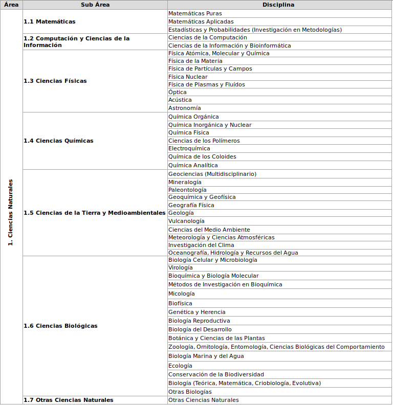
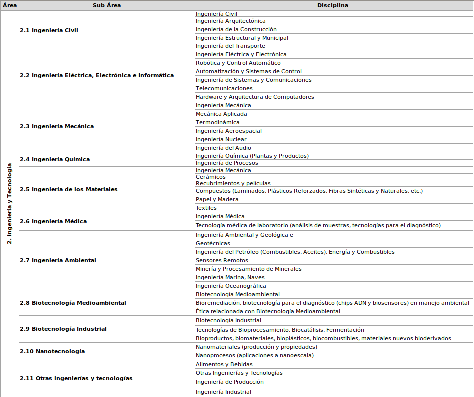
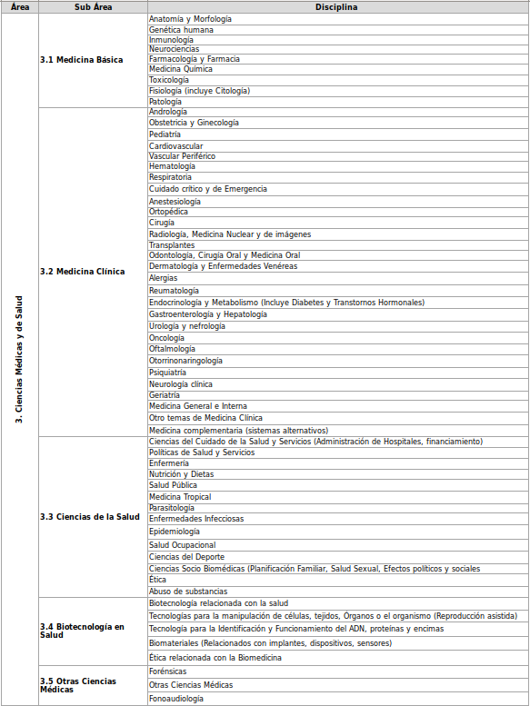

.. anexo5:

Anexo 5. Clasificación de áreas científicas según la OCDE
=========================================================

1. Ciencias Naturales      

2. Ingeniería y Tecnología

3. Ciencias Médicas y de Salud

Descargar archivo excel Anexo 5 [#]_ :download:`xlsx <_static/Anexo5OCDE.xlsx>`

.. [#] https://openaire4.readthedocs.io/es/latest/_downloads/c42c4e9721033a328a126e6a70190a27/Anexo5OCDE.xlsx