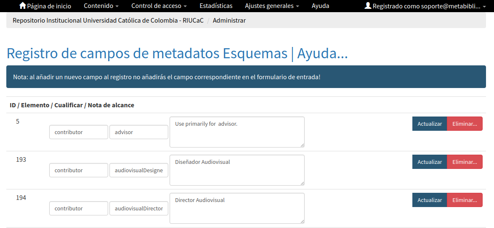

.. _estructuraDoc:

Estructura del Perfil de Aplicación REDCOL (Campos de Metadatos)
================================================================

Este esquema de aplicación proporciona una descripción detallada del conjunto de campos de metadatos normalizados y adaptados para describir los distintos productos de información científica reconocidos por MinCiencias. En este apartado se tuvieron en cuenta los aspectos  e interoperabilidad (sintácticos, semánticos y estructurales) y su forma de aplicación en los sistemas de información más utilizados en la actualidad. 

Para el análisis de cada uno de los campo de metadatos que son utilizados por este conjunto de directrices para productos de información científica, se tuvo en cuenta los siguientes componentes de evaluación:

	- **Definición y alcance del campo (X.1):** Se exponen con precisión los conceptos de los campo y se determina de forma clara y sencilla los objetivos que se quieren alcanzar en cada uno.

	- **Cardinalidad de Metadatos:** Se especifican propiedades de presencia y ocurrencia de cada campo de metadatos

	- **Niveles de persistencia (X.2):** Son las propiedades de existencia de los metadatos definidas así:

		- **Obligatorio = Mandatory (M):** La propiedad siempre debe estar presente en los metadatos. No se permite un valor vacío para la propiedad.
		- **Obligatorio si es aplicable = Mandatory if Applicable (MA):** Cuando se puede obtener el valor de la propiedad, debe estar presente en los metadatos.
		- **Recomendado = Recommended (R):** Aunque su uso no es obligatorio, Se recomienda el uso de la propiedad.
		- **Opcional = Optional (O):** No es importante si la propiedad se usa o no, pero si se usa puede proporcionar información complementaria sobre el recurso.

	- **Niveles de ocurrencia (X.3):** Se especifica la repetibilidad o  no repetibilidad de cada campo según su naturaleza.
		- **Repetible (R):** El campo de metadatos puede utilizarse 1 o más veces (1-n)
		- **No repetible (NR):** El campo de metadatos debe utilizarse solamente una vez. (1)

	- **Esquema (Modelo) de metadatos (X.4):** Determina el modelo de metadatos aplicado para la definición y utilización del campo. Estas directrices contemplan la utilización de los siguientes modelos de metadatos:

..

+-------------------------------------------------------------+---------------------+
| Modelo de Metadatos                                         | Codificación REDCOL |
+=============================================================+=====================+
| Simple DC XML Schema                                        | dc                  |
+-------------------------------------------------------------+---------------------+
| DCMI Metadata Terms Schema                                  | dcterms             |
+-------------------------------------------------------------+---------------------+
| Learning Object Metadata Schema definition (LOM)            | lom                 |
+-------------------------------------------------------------+---------------------+
| Electronic Theses and Dissertation Metadata Schema (ETD-MS) | thesis              |
+-------------------------------------------------------------+---------------------+
| DataCite Metadata Schema                                    | datacite            |
+-------------------------------------------------------------+---------------------+
| OpenAire Specification Schema                               | oaire               |
+-------------------------------------------------------------+---------------------+
| Red Colombiana de Información Científica                    | redcol              |
+-------------------------------------------------------------+---------------------+

..

	- **Traducción al español (X.5):** Nombre del campo de metadato en idioma español. 
	
..

	- **Forma de descripción normalizada (X.6):** Aquí se indica la forma correcta de la descripción del campo según la normatividad internacional aplicada. Ejemplo: RDA (Recursos : descripción y acceso) - RCAA2 (Reglas de Catalogación Angloamericanas 2).
	  
..

	- **Propiedades, atributos y especificadores de campo (X.7):**  Este apartado muestra las diversos formas de representar los campos a partir de su especificidad y sus características sintácticas.
	  
..

	- **Relaciones con otros campos (X.81):** Aquí se describen otros campos relacionados con el tipo de contenido referenciado al describir el recurso

..

	- **Restricciones (X.9):** Información que no debe utilizarse en el campo.
	  
..

	- **Ejemplos y ayudas (X.10):** Se describen ejemplos de la forma correcta para la descripción del campo, adicionalmente se muestran ayudas de despliegue de los archivos XML durante transacciones interoperabilidad (Protocolo OAI-PMH)
	
..

	- **Niveles de aplicación para productos de investigación de MinCiencias (X.11):** Se especifican recomendaciones de uso del campo de metadatos enfocado a los distintos que producto de investigación reconocidos por MinCiencias (Tipologías Documentales).

..

	- **Relaciones con otros modelos de metadatos (X.12):** Se relacionan otros esquemas (Modelos) de metadatos que apliquen.
	  
..

	- **Niveles semánticos (X.13):** Permiten asignar significado a la información sobre los atributos, lenguajes controlados, vocabularios controlados y/o términos extraídos de tesauros que se apliquen al campo.

..

	- **Recomendación de campos de aplicación en DSPACE (X.14):** Se ofrece una recomendación general de normalización de esquemas de registro de metadatos, Campos/Elementos, Calificadores/Especificadores y Notas de alcance que deben ser configuradas en DSPACE con el fin de obtener campos normalizados en el despliegue y durante el proceso de cosecha (protocolo OAI-PMH) utilizando los distintos modelos de metadatos ofrecidos por DSPACE (uketd_dc, qdc, didl, mods, mets, ore, rdf, marc, oai_dc, xoai, dim, etdms, etc.) que permiten maximizar los procesos de validación sintáctica, semántica y estructural. 

..

..

	- **Recomendaciones de migración de otras directrices de metadatos (X.15):** Información que se debe tener en cuenta al momento de migrar modelos y esquemas de metadatos anteriores como: BDCOL, SNAAC, LA REFERENCIA, DRIVER, OPENAIRE 2.0, OPENAIRE 3.0.