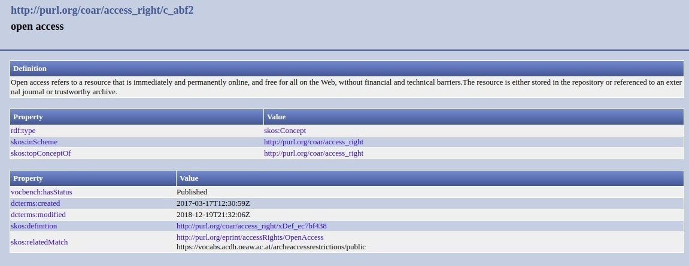

.. _dci:accessrights:

Derechos de acceso (M)
======================

``datacite:rights``

Definición y alcance del campo
------------------------------
Se describen las condiciones de acceso al recurso según su contenido. 

No confundir con Condición de la licencia (R).

Niveles de requerimientos (M/MA/R/O)
------------------------------------
Obligatorio (M)

Niveles de ocurrencia (R / NR -  Cantidad Veces)
------------------------------------------------
No repetible (NR)

Campo con esquema de metadatos
------------------------------
datacite:rights

Traducción al español
---------------------
Derechos de acceso

Forma de Descripción Normalizada (RDA / RCAA2)
----------------------------------------------
RDA (Recursos: descripción y acceso)

Revise la forma adecuada para seleccionar el tipo de recurso:

- **datacite:rights:** Se debe de seleccionar las condiciones de acceso que se le van a dar al recurso definidas previamente en los atributos del campo con la definición previa del vocabulario controlado de Coar. Ej: uri: http://vocabularies.coar-repositories.org/access_right/c_abf2.html Acceso Abierto

Valores permitidos (Vocabularios Controlados)
---------------------------------------------
datacite:rights

Relaciones con otros campos
---------------------------

- dc.rights.accessrights

Restricciones
-------------

Ejemplos
--------

.. code-block:: xml
   :linenos:

   <datacite:rights rightsURI="http://purl.org/coar/access_right/c_abf2">open access</datacite:rights>

.. _COAR Access Right Vocabulary: http://vocabularies.coar-repositories.org/documentation/access_rights/

Atributos de Campo
------------------
Use el siguiente vocabulario de acceso COAR: http://vocabularies.coar-repositories.org/documentation/access_rights/

+-----------------------------------------------+-------------------------+
| ConceptURI                                    | Etiqueta                |
+===============================================+=========================+
| http://purl.org/coar/access_right/c_abf2      | Acceso abierto          |
+-----------------------------------------------+-------------------------+
| http://purl.org/coar/access_right/c_f1cf      | Acceso embargado        |
+-----------------------------------------------+-------------------------+
| http://purl.org/coar/access_right/c_16ec      | Acceso restringido      |
+-----------------------------------------------+-------------------------+
| http://purl.org/coar/access_right/c_14cb      | Acceso a solo metadatos |
+-----------------------------------------------+-------------------------+

Especificadores de campo
------------------------

Niveles de aplicación para productos de investigación de Colciencias
--------------------------------------------------------------------
Se aplica a todos los productos de Colciencias. 

Relaciones con otros modelos de metadatos
-----------------------------------------

Niveles semánticos
------------------

Tomado de: `Vocabularios controlados - COAR <http://vocabularies.coar-repositories.org/access_right/c_abf2.html>`_

Recomendación de campos de aplicación en DSPACE
-----------------------------------------------
Se recomienda crear los siguientes campos en Dspace:

- dc.rights.accessrights

Recomendaciones de migración de Modelos anteriores (BDCOL, SNAAC, LA REFERENCIA, OPENAIRE 2, OPENAIRE 3)
--------------------------------------------------------------------------------------------------------
