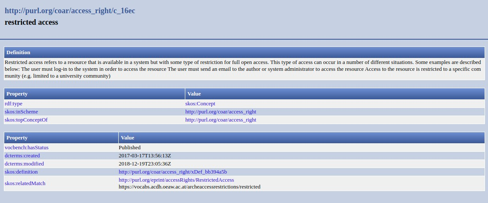

.. _aire:file:

Ubicación del archivo (MA)
==========================

``oaire:file``

Definición y alcance del campo
------------------------------
Hace referencia a la ubicación de un archivo que está asociado al recurso. 

Niveles de requerimientos (M/MA/R/O)
------------------------------------
Obligatorio si es aplicable (MA)

Niveles de ocurrencia (R / NR -  Cantidad Veces)
------------------------------------------------
No repetible (NR)

Campo con esquema de metadatos
------------------------------
oaire:file

Traducción al español
---------------------
Ubicación del archivo

Forma de Descripción Normalizada (RDA / RCAA2)
----------------------------------------------
RDA (Recursos: descripción y acceso)

Para el tipo de recurso, seleccione los siguientes atributos de la lista controlada:

- Full Text - Texto completo
- Dataset - Conjunto de datos
- Software - Software
- Other - Otro

Valores permitidos (Vocabularios Controlados)
---------------------------------------------
oaire:file

Relaciones con otros campos
---------------------------

Restricciones
-------------

Ejemplos
--------

.. code-block:: xml
   :linenos:

   <oaire:file accessRightsURI="http://purl.org/coar/access_right/c_abf2" mimeType="application/pdf" objectType="fulltext">http://link-to-the-fulltext.org</oaire:file>

.. _COAR Access Right Vocabulary: http://vocabularies.coar-repositories.org/documentation/access_rights/

Atributos de Campo
------------------
Use los términos del vocabulario controlado:

+------------------------------------------+---------------------+
| ConceptURI                               | Etiqueta            |
+==========================================+=====================+
| http://purl.org/coar/access_right/c_abf2 | Acceso abierto      |
+------------------------------------------+---------------------+
| http://purl.org/coar/access_right/c_f1cf | Acceso embargado    |
+------------------------------------------+---------------------+
| http://purl.org/coar/access_right/c_16ec | Acceso restringido  |
+------------------------------------------+---------------------+
| http://purl.org/coar/access_right/c_14cb | Acceso solo a       |
|                                          | metadatos           |
+------------------------------------------+---------------------+

Especifique el el formato del archivo, se recomienda seleccionar los tributos de tipo de medio: http://www.iana.org/assignments/media-types 

Para el tipo de objeto, seleccione los siguientes atributos de la lista controlada:

- fulltext
- dataset
- software
- other

Especificadores de campo
------------------------

Niveles de aplicación para productos de investigación de Colciencias
--------------------------------------------------------------------
Se aplica a todos los productos de Colciencias. 

Relaciones con otros modelos de metadatos
-----------------------------------------

Niveles semánticos
------------------

Tomado de: `Vocabularios controlados Coar <http://vocabularies.coar-repositories.org/access_right/c_16ec.html>`_

Recomendación de campos de aplicación en DSPACE
-----------------------------------------------

Se recomienda crear los siguientes campos en Dspace:

- oaire:file

Recomendaciones de migración de Modelos anteriores (BDCOL, SNAAC, LA REFERENCIA, OPENAIRE 2, OPENAIRE 3)
--------------------------------------------------------------------------------------------------------
