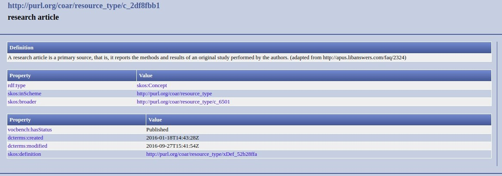

.. _aire:resourceType:

Tipo de recurso (M) 
===================

``oaire:resourceType``

Definición y alcance del campo
------------------------------
Hace referencia al tipo de producción científica o contenido intelectual en el que se manifiesta el recurso. Y es utilizado por el usuario para identificar el recurso que está buscando. Ejemplo: Libro, artículo, revista, etc. 

No confundir con el campo Formato (R), porque hace referencia al tipo de medio en el que está el recurso. 

Niveles de requerimientos (M/MA/R/O)
------------------------------------
Obligatorio (M)

Niveles de ocurrencia (R / NR -  Cantidad Veces)
------------------------------------------------
No repetible (NR)

Campo con esquema de metadatos
------------------------------
oaire:resourcetype 

Traducción al español
---------------------
Tipo de recurso

Forma de Descripción Normalizada (RDA / RCAA2)
----------------------------------------------
Revise la forma adecuada para seleccionar el tipo de recurso:

- **oaire:resourceType:** Se debe seleccionar el tipo de recurso que debe estar debidamente relacionado con una uri definido con el vocabulario controlado de Coar, lo que permite tener una relación semántica. Ej: uri= http://vocabularies.coar-repositories.org/pubby/resource_type/c_2df8fbb1.html Artículo de investigación.

Valores permitidos (Vocabularios Controlados)
---------------------------------------------
Ver vocabularios http://vocabularies.coar-repositories.org/documentation/resource_types/ 

Relaciones con otros campos
---------------------------

- dc.type

Restricciones
-------------

Ejemplos
--------

.. code-block:: xml
   :linenos:

   <oaire:resourceType resourceTypeGeneral="literature" uri="http://purl.org/coar/resource_type/c_6501">journal article</oaire:resourceType>

.. _COAR Resource Type Vocabulary: http://vocabularies.coar-repositories.org/documentation/resource_types/
 
Atributos de Campo
------------------

+-----------------------------------------------+-------------------------+
| ConceptURI                                    | Etiqueta                |
+===============================================+=========================+
| http://purl.org/coar/resource_type/c_1162     | Anotación               |
+-----------------------------------------------+-------------------------+
| http://purl.org/coar/resource_type/c_6501     | Artículo de revista     |
+-----------------------------------------------+-------------------------+
| http://purl.org/coar/resource_type/c_545b     | Carta al editor         |
+-----------------------------------------------+-------------------------+
| http://purl.org/coar/resource_type/c_b239     | Editorial               |
+-----------------------------------------------+-------------------------+
| http://purl.org/coar/resource_type/c_2df8fbb1 | Artículo de             |
|                                               | investigación           |
+-----------------------------------------------+-------------------------+
| http://purl.org/coar/resource_type/c_dcae04bc | Artículo de revisión    |
+-----------------------------------------------+-------------------------+
| http://purl.org/coar/resource_type/c_beb9     | Papel de datos          |
+-----------------------------------------------+-------------------------+
| http://purl.org/coar/resource_type/c_3e5a     | Contribución a la       |
|                                               | revista                 |
+-----------------------------------------------+-------------------------+
| http://purl.org/coar/resource_type/c_ba08     | Reseña de libro         |
+-----------------------------------------------+-------------------------+
| http://purl.org/coar/resource_type/c_3248     | Parte de libro          |
+-----------------------------------------------+-------------------------+
| http://purl.org/coar/resource_type/c_2f33     | Libro                   |
+-----------------------------------------------+-------------------------+
| http://purl.org/coar/resource_type/c_86bc     | Bibliografía            |
+-----------------------------------------------+-------------------------+
| http://purl.org/coar/resource_type/c_816b     | Preimpresión            |
+-----------------------------------------------+-------------------------+
| http://purl.org/coar/resource_type/c_8042     | Documento de trabajo    |
+-----------------------------------------------+-------------------------+
| http://purl.org/coar/resource_type/c_71bd     | Documentación técnica   |
+-----------------------------------------------+-------------------------+
| http://purl.org/coar/resource_type/c_18gh     | Reporte técnico         |
+-----------------------------------------------+-------------------------+
| http://purl.org/coar/resource_type/c_18ws     | Informe de investigación|
+-----------------------------------------------+-------------------------+
| http://purl.org/coar/resource_type/c_18hj     | Informe agencia de      |
|                                               | financiamiento          |
+-----------------------------------------------+-------------------------+
| http://purl.org/coar/resource_type/c_18op     | Entregable de proyecto  |
+-----------------------------------------------+-------------------------+
| http://purl.org/coar/resource_type/c_186u     | Informe de política     |
+-----------------------------------------------+-------------------------+
| http://purl.org/coar/resource_type/c_18wq     | Otro tipo de informe    |
+-----------------------------------------------+-------------------------+
| http://purl.org/coar/resource_type/c_18wz     | Memorando               |
+-----------------------------------------------+-------------------------+
| http://purl.org/coar/resource_type/c_18ww     | Informe interno         |
+-----------------------------------------------+-------------------------+
| http://purl.org/coar/resource_type/c_efa0     | Revisión                |
+-----------------------------------------------+-------------------------+
| http://purl.org/coar/resource_type/c_baaf     | Propuesta de            |
|                                               | investigación           |
+-----------------------------------------------+-------------------------+
| http://purl.org/coar/resource_type/c_ba1f     | Parte del informe       |
+-----------------------------------------------+-------------------------+
| http://purl.org/coar/resource_type/c_93fc     | Informe                 |
+-----------------------------------------------+-------------------------+
| http://purl.org/coar/resource_type/c_15cd     | Patente                 |
+-----------------------------------------------+-------------------------+
| http://purl.org/coar/resource_type/c_18co     | Documento de conferencia|
|                                               | en proceso              |
+-----------------------------------------------+-------------------------+
| http://purl.org/coar/resource_type/c_18cp     | Documento de conferencia|
|                                               | en no proceso           |
+-----------------------------------------------+-------------------------+
| http://purl.org/coar/resource_type/c_6670     | Póster de la conferencia|
+-----------------------------------------------+-------------------------+
| http://purl.org/coar/resource_type/c_5794     | Documento de sesión     |
+-----------------------------------------------+-------------------------+
| http://purl.org/coar/resource_type/c_c94f     | Objeto de conferencia   |
+-----------------------------------------------+-------------------------+
| http://purl.org/coar/resource_type/c_f744     | Actas de conferencia    |
+-----------------------------------------------+-------------------------+
| http://purl.org/coar/resource_type/c_7a1f     | Trabajo de grado de     |
|                                               | pregrado                |
+-----------------------------------------------+-------------------------+
| http://purl.org/coar/resource_type/c_bdcc     | Tesis de maestría       |
+-----------------------------------------------+-------------------------+
| http://purl.org/coar/resource_type/c_db06     | Tesis doctoral          |
+-----------------------------------------------+-------------------------+
| http://purl.org/coar/resource_type/c_46ec     | Tesis                   |
+-----------------------------------------------+-------------------------+
| http://purl.org/coar/resource_type/c_0857     | Carta                   |
+-----------------------------------------------+-------------------------+
| http://purl.org/coar/resource_type/c_8544     | Conferencia             |
+-----------------------------------------------+-------------------------+
| http://purl.org/coar/resource_type/c_18cf     | Texto                   |
+-----------------------------------------------+-------------------------+
| http://purl.org/coar/resource_type/c_18cw     | Notación musical        |
+-----------------------------------------------+-------------------------+
| http://purl.org/coar/resource_type/c_18cd     | Composición musical     |
+-----------------------------------------------+-------------------------+
| http://purl.org/coar/resource_type/c_18cc     | Sonido                  |
+-----------------------------------------------+-------------------------+
| http://purl.org/coar/resource_type/c_12ce     | Video                   |
+-----------------------------------------------+-------------------------+
| http://purl.org/coar/resource_type/c_8a7e     | Imagen en movimiento    |
+-----------------------------------------------+-------------------------+
| http://purl.org/coar/resource_type/c_ecc8     | Imagen fija             |
+-----------------------------------------------+-------------------------+
| http://purl.org/coar/resource_type/c_c513     | Imagen                  |
+-----------------------------------------------+-------------------------+
| http://purl.org/coar/resource_type/c_12cd     | Mapa                    |
+-----------------------------------------------+-------------------------+
| http://purl.org/coar/resource_type/c_12cc     | Material cartográfico   |
+-----------------------------------------------+-------------------------+
| http://purl.org/coar/resource_type/c_5ce6     | Software                |
+-----------------------------------------------+-------------------------+
| http://purl.org/coar/resource_type/c_ddb1     | Conjunto de datos       |
+-----------------------------------------------+-------------------------+
| http://purl.org/coar/resource_type/c_e9a0     | Recurso interactivo     |
+-----------------------------------------------+-------------------------+
| http://purl.org/coar/resource_type/c_7ad9     | Sitio web               |
+-----------------------------------------------+-------------------------+
| http://purl.org/coar/resource_type/c_393c     | Flujo de trabajo        |
+-----------------------------------------------+-------------------------+
| http://purl.org/coar/resource_type/c_1843     | Otro                    |
+-----------------------------------------------+-------------------------+

Especificadores de campo
------------------------

Niveles de aplicación para productos de investigación de Colciencias
--------------------------------------------------------------------
REDCOL ha desarrollado el siguiente vocabulario controlado acorde con los productos de investigación reconocidos y avalados por Colciencias y que se ciñe a los modelos semánticos provistos por DATACITE y OPENAIRE.  

Los sistemas de información deben utilizar estos nuevos elementos para describir tipologías documentales que no se encuentran descritas en el Vocabulario normalizado de Tipos Documentales OPENAIRE-COAR. En este contexto, para describir estos tipos documentales asociados a los productos específicos de Colciencias,  para el campo anterior  se debe utilizar  el valor “other - http://purl.org/coar/resource_type/c_1843”  y posteriromente seleccionar el tipo documental específico que se muestra a continuación:Colciencias.

- Productos resultados de actividades de generación de nuevo conocimiento:

+---------------------------------------------------------------+------------------------------------------------------------------------------------------------------------------------------------+---------------------------------------------------------------------------------------------------+
| Tipo Documental Específico Colciencias                        | Notas                                                                                                                              | Valor Autorizado                                                                                  |
+===============================================================+====================================================================================================================================+===================================================================================================+
| Artículos de investigación                                    | Campo ya descrito en Vocabulario COAR/OPENAIRE. http://purl.org/coar/resource_type/c_2f33                                          | Se genera equivalencia semántica (de uso opcional): https://purl.org/redcol/resource_type/ART     |
+---------------------------------------------------------------+------------------------------------------------------------------------------------------------------------------------------------+---------------------------------------------------------------------------------------------------+
| Notas Científicas                                             |                                                                                                                                    |                                                                                                   |
+---------------------------------------------------------------+------------------------------------------------------------------------------------------------------------------------------------+---------------------------------------------------------------------------------------------------+
| Libros resultado de investigación                             | Campo ya descrito en Vocabulario COAR/OPENAIRE                                                                                     | Se genera equivalencia semántica (de uso opcional): https://purl.org/redcol/resource_type/LIB     |
+---------------------------------------------------------------+------------------------------------------------------------------------------------------------------------------------------------+---------------------------------------------------------------------------------------------------+
| Capítulos en libro resultado de investigación                 | Campo ya descrito en Vocabulario COAR                                                                                              | Se genera equivalencia semántica (de uso opcional): https://purl.org/redcol/resource_type/CAP_LIB |
+---------------------------------------------------------------+------------------------------------------------------------------------------------------------------------------------------------+---------------------------------------------------------------------------------------------------+
| Patente de invención                                          | Selecionar del Vocabulario COAR/OPENAIRE “Patente” y utilizar el siguiente elemento semántico para especificar el tipo de Patente: | https://purl.org/redcol/resource_type/PA                                                          |
+---------------------------------------------------------------+------------------------------------------------------------------------------------------------------------------------------------+---------------------------------------------------------------------------------------------------+
| Patente de modelo de utilidad                                 | Selecionar del Vocabulario COAR/OPENAIRE “Patente” y utilizar el siguiente elemento semántico para especificar el tipo de Patente: | https://purl.org/redcol/resource_type/MA                                                          |
+---------------------------------------------------------------+------------------------------------------------------------------------------------------------------------------------------------+---------------------------------------------------------------------------------------------------+
| Variedad vegetal y variedad animal                            | Campo ya descrito en Vocabulario COAR                                                                                              | https://purl.org/redcol/resource_type/VV                                                          |
+---------------------------------------------------------------+------------------------------------------------------------------------------------------------------------------------------------+---------------------------------------------------------------------------------------------------+
| Nueva raza animal                                             |                                                                                                                                    |                                                                                                   |
+---------------------------------------------------------------+------------------------------------------------------------------------------------------------------------------------------------+---------------------------------------------------------------------------------------------------+
| Poblaciones mejoradas de razas pecuarias                      |                                                                                                                                    |                                                                                                   |
+---------------------------------------------------------------+------------------------------------------------------------------------------------------------------------------------------------+---------------------------------------------------------------------------------------------------+
| Obras o Productos de creación en artes, arquitectura y diseño | Campo ya descrito en Vocabulario COAR                                                                                              | https://purl.org/redcol/resource_type/AAD                                                         |
+---------------------------------------------------------------+------------------------------------------------------------------------------------------------------------------------------------+---------------------------------------------------------------------------------------------------+

- Productos resultados de actividades de desarrollo tecnológico e innovación.

+----------------------------------------------------------------------------------+---------------------------------------+----------------------------------------+
| Tipo Documental Específico Colciencias                                           | Notas                                 | Valor Autorizado                       |
+==================================================================================+=======================================+========================================+
|                                **Productos Tecnológicos Certificados o Validados**                                                                                |
+----------------------------------------------------------------------------------+---------------------------------------+----------------------------------------+
| Diseño industrial                                                                | Campo ya descrito en Vocabulario COAR | https://purl.org/redcol/resource_type/ |
+----------------------------------------------------------------------------------+---------------------------------------+----------------------------------------+
| Esquema de trazado de circuito integrado                                         | Campo ya descrito en Vocabulario COAR | https://purl.org/redcol/resource_type/ |
+----------------------------------------------------------------------------------+---------------------------------------+----------------------------------------+
| Software                                                                         | Campo ya descrito en Vocabulario COAR | https://purl.org/redcol/resource_type/ |
+----------------------------------------------------------------------------------+---------------------------------------+----------------------------------------+
| Planta piloto                                                                    | Campo ya descrito en Vocabulario COAR | https://purl.org/redcol/resource_type/ |
+----------------------------------------------------------------------------------+---------------------------------------+----------------------------------------+
| Prototipo industrial                                                             | Campo ya descrito en Vocabulario COAR | https://purl.org/redcol/resource_type/ |
+----------------------------------------------------------------------------------+---------------------------------------+----------------------------------------+
| Signos distintivos                                                               | Campo ya descrito en Vocabulario COAR | https://purl.org/redcol/resource_type/ |
+----------------------------------------------------------------------------------+---------------------------------------+----------------------------------------+
| Productos nutraceúticos                                                          | Campo ya descrito en Vocabulario COAR | https://purl.org/redcol/resource_type/ |
+----------------------------------------------------------------------------------+---------------------------------------+----------------------------------------+
| Colección científica                                                             | Campo ya descrito en Vocabulario COAR | https://purl.org/redcol/resource_type/ |
+----------------------------------------------------------------------------------+---------------------------------------+----------------------------------------+
| Nuevo registro científico                                                        | Campo ya descrito en Vocabulario COAR | https://purl.org/redcol/resource_type/ |
+----------------------------------------------------------------------------------+---------------------------------------+----------------------------------------+
|                                    **Productos Empresariales**                                                                                                    |
+----------------------------------------------------------------------------------+---------------------------------------+----------------------------------------+
| Secreto empresarial                                                              | Campo ya descrito en Vocabulario COAR | https://purl.org/redcol/resource_type/ |
+----------------------------------------------------------------------------------+---------------------------------------+----------------------------------------+
| Empresas de base tecnológica (Spin-off y Start-up)                               | Campo ya descrito en Vocabulario COAR | https://purl.org/redcol/resource_type/ |
+----------------------------------------------------------------------------------+---------------------------------------+----------------------------------------+
| Empresas creativas y culturales                                                  | Campo ya descrito en Vocabulario COAR | https://purl.org/redcol/resource_type/ |
+----------------------------------------------------------------------------------+---------------------------------------+----------------------------------------+
| Innovación generada en la gestión empresarial                                    | Campo ya descrito en Vocabulario COAR | https://purl.org/redcol/resource_type/ |
+----------------------------------------------------------------------------------+---------------------------------------+----------------------------------------+
| Innovación en procedimiento y servicio                                           | Campo ya descrito en Vocabulario COAR | https://purl.org/redcol/resource_type/ |
+----------------------------------------------------------------------------------+---------------------------------------+----------------------------------------+
| Regulación Norma o Reglamento                                                    | Campo ya descrito en Vocabulario COAR | https://purl.org/redcol/resource_type/ |
+----------------------------------------------------------------------------------+---------------------------------------+----------------------------------------+
| Guía de Práctica Clínica                                                         | Campo ya descrito en Vocabulario COAR | https://purl.org/redcol/resource_type/ |
+----------------------------------------------------------------------------------+---------------------------------------+----------------------------------------+
| Guía de Manejo Clínico Forense                                                   | Campo ya descrito en Vocabulario COAR | https://purl.org/redcol/resource_type/ |
+----------------------------------------------------------------------------------+---------------------------------------+----------------------------------------+
| Manuales y Modelos de atención diferencial a víctimas                            | Campo ya descrito en Vocabulario COAR | https://purl.org/redcol/resource_type/ |
+----------------------------------------------------------------------------------+---------------------------------------+----------------------------------------+
| Protocolos de atención a usuarios                                                | Campo ya descrito en Vocabulario COAR | https://purl.org/redcol/resource_type/ |
+----------------------------------------------------------------------------------+---------------------------------------+----------------------------------------+
| Acto legislativo                                                                 | Campo ya descrito en Vocabulario COAR | https://purl.org/redcol/resource_type/ |
+----------------------------------------------------------------------------------+---------------------------------------+----------------------------------------+
| Proyecto de Ley                                                                  | Campo ya descrito en Vocabulario COAR | https://purl.org/redcol/resource_type/ |
+----------------------------------------------------------------------------------+---------------------------------------+----------------------------------------+
|                                      **Conceptos técnicos**                                                                                                       |
+----------------------------------------------------------------------------------+---------------------------------------+----------------------------------------+
| Conceptos técnicos                                                               | Campo ya descrito en Vocabulario COAR | https://purl.org/redcol/resource_type/ |
+----------------------------------------------------------------------------------+---------------------------------------+----------------------------------------+
| Informe final de investigación                                                   | Campo ya descrito en Vocabulario COAR | https://purl.org/redcol/resource_type/ |
+----------------------------------------------------------------------------------+---------------------------------------+----------------------------------------+
| Acuerdo de licencia para la explotación de obras protegidas por derecho de autor | Campo ya descrito en Vocabulario COAR | https://purl.org/redcol/resource_type/ |
+----------------------------------------------------------------------------------+---------------------------------------+----------------------------------------+

..

- Productos resultados de actividades de apropiación social del conocimiento.

..

+----------------------------------------------------------------------------------+---------------------------------------+----------------------------------------+
| Tipo Documental Específico Colciencias                                           | Notas                                 | Valor Autorizado                       |
+==================================================================================+=======================================+========================================+
| Participación ciudadana en proyectos de CTI                                      | Campo ya descrito en Vocabulario COAR | https://purl.org/redcol/resource_type/ |
+----------------------------------------------------------------------------------+---------------------------------------+----------------------------------------+
| Espacios de participación ciudadana en CTI                                       | Campo ya descrito en Vocabulario COAR | https://purl.org/redcol/resource_type/ |
+----------------------------------------------------------------------------------+---------------------------------------+----------------------------------------+
| Estrategia pedagógicas para el fomento a la CTI                                  | Campo ya descrito en Vocabulario COAR | https://purl.org/redcol/resource_type/ |
+----------------------------------------------------------------------------------+---------------------------------------+----------------------------------------+
| Estrategia de comunicación del conocimiento                                      | Campo ya descrito en Vocabulario COAR | https://purl.org/redcol/resource_type/ |
+----------------------------------------------------------------------------------+---------------------------------------+----------------------------------------+
| Generación de contenido                                                          | Campo ya descrito en Vocabulario COAR | https://purl.org/redcol/resource_type/ |
+----------------------------------------------------------------------------------+---------------------------------------+----------------------------------------+
| Evento científico                                                                | Campo ya descrito en Vocabulario COAR | https://purl.org/redcol/resource_type/ |
+----------------------------------------------------------------------------------+---------------------------------------+----------------------------------------+
| Red de conocimiento especializado                                                | Campo ya descrito en Vocabulario COAR | https://purl.org/redcol/resource_type/ |
+----------------------------------------------------------------------------------+---------------------------------------+----------------------------------------+
| Taller de Creación                                                               | Campo ya descrito en Vocabulario COAR | https://purl.org/redcol/resource_type/ |
+----------------------------------------------------------------------------------+---------------------------------------+----------------------------------------+
| Eventos culturales y artísticos                                                  | Campo ya descrito en Vocabulario COAR | https://purl.org/redcol/resource_type/ |
+----------------------------------------------------------------------------------+---------------------------------------+----------------------------------------+
| Documento de trabajo                                                             | Campo ya descrito en Vocabulario COAR | https://purl.org/redcol/resource_type/ |
+----------------------------------------------------------------------------------+---------------------------------------+----------------------------------------+
| Nueva Secuencia Genética                                                         | Campo ya descrito en Vocabulario COAR | https://purl.org/redcol/resource_type/ |
+----------------------------------------------------------------------------------+---------------------------------------+----------------------------------------+
| Boletín divulgativo de resultado de investigación                                | Campo ya descrito en Vocabulario COAR | https://purl.org/redcol/resource_type/ |
+----------------------------------------------------------------------------------+---------------------------------------+----------------------------------------+
| Edición                                                                          | Campo ya descrito en Vocabulario COAR | https://purl.org/redcol/resource_type/ |
+----------------------------------------------------------------------------------+---------------------------------------+----------------------------------------+
| Informe de investigación                                                         | Campo ya descrito en Vocabulario COAR | https://purl.org/redcol/resource_type/ |
+----------------------------------------------------------------------------------+---------------------------------------+----------------------------------------+
| Consultoría científicas-tecnologías                                              | Campo ya descrito en Vocabulario COAR | https://purl.org/redcol/resource_type/ |
+----------------------------------------------------------------------------------+---------------------------------------+----------------------------------------+
| Consultoría de procesos en investigación-creación en arte, arquitectura y diseño | Campo ya descrito en Vocabulario COAR | https://purl.org/redcol/resource_type/ |
+----------------------------------------------------------------------------------+---------------------------------------+----------------------------------------+
| Dirección de Tesis de doctorado                                                  | Campo ya descrito en Vocabulario COAR | https://purl.org/redcol/resource_type/ |
+----------------------------------------------------------------------------------+---------------------------------------+----------------------------------------+
| Dirección de Trabajo de grado de maestría                                        | Campo ya descrito en Vocabulario COAR | https://purl.org/redcol/resource_type/ |
+----------------------------------------------------------------------------------+---------------------------------------+----------------------------------------+
| Dirección de Trabajos de grado de pregrado                                       | Campo ya descrito en Vocabulario COAR | https://purl.org/redcol/resource_type/ |
+----------------------------------------------------------------------------------+---------------------------------------+----------------------------------------+
| Proyecto de investigación y Desarrollo                                           | Campo ya descrito en Vocabulario COAR | https://purl.org/redcol/resource_type/ |
+----------------------------------------------------------------------------------+---------------------------------------+----------------------------------------+
| Proyecto de investigación-Creación                                               | Campo ya descrito en Vocabulario COAR | https://purl.org/redcol/resource_type/ |
+----------------------------------------------------------------------------------+---------------------------------------+----------------------------------------+
| Proyecto ID+I con formación                                                      | Campo ya descrito en Vocabulario COAR | https://purl.org/redcol/resource_type/ |
+----------------------------------------------------------------------------------+---------------------------------------+----------------------------------------+
| Proyecto de extensión y responsabilidad social en CTI                            | Campo ya descrito en Vocabulario COAR | https://purl.org/redcol/resource_type/ |
+----------------------------------------------------------------------------------+---------------------------------------+----------------------------------------+
| Apoyo de programas                                                               | Campo ya descrito en Vocabulario COAR | https://purl.org/redcol/resource_type/ |
+----------------------------------------------------------------------------------+---------------------------------------+----------------------------------------+
| Apoyo creación de cursos                                                         | Campo ya descrito en Vocabulario COAR | https://purl.org/redcol/resource_type/ |
+----------------------------------------------------------------------------------+---------------------------------------+----------------------------------------+
| Asesoría al programa Ondas                                                       | Campo ya descrito en Vocabulario COAR | https://purl.org/redcol/resource_type/ |
+----------------------------------------------------------------------------------+---------------------------------------+----------------------------------------+

..

- Productos de actividades relacionadas con la Formación de Recurso Humano en CTeI.

..

+-----------------------------------------------------------------+-------+------------------+
| Tipo Documental Específico Colciencias                          | Notas | Valor Autorizado |
+=================================================================+=======+==================+
| Proyectos de investigación-creación                             |       |                  |
+-----------------------------------------------------------------+-------+------------------+
| Proyectos de investigación, Desarrollo e Innovación (ID+I)      |       |                  |
+-----------------------------------------------------------------+-------+------------------+
| Proyectos de extensión y responsabilidad social en CTI          |       |                  |
+-----------------------------------------------------------------+-------+------------------+
| Apoyo a programas de formación                                  |       |                  |
+-----------------------------------------------------------------+-------+------------------+
| Acompañamiento y asesorías de línea temática del Programa Ondas |       |                  |
+-----------------------------------------------------------------+-------+------------------+

Relaciones con otros modelos de metadatos
-----------------------------------------

Niveles semánticos
------------------

Tomado de: `Vocabularios controlados - COAR <http://vocabularies.coar-repositories.org/pubby/resource_type/c_2df8fbb1.html>`_

Recomendación de campos de aplicación en DSPACE
-----------------------------------------------

Se recomienda crear los siguientes campos en Dspace:

- oaire:resourceType

Recomendaciones de migración de Modelos anteriores (BDCOL, SNAAC, LA REFERENCIA, OPENAIRE 2, OPENAIRE 3)
--------------------------------------------------------------------------------------------------------
