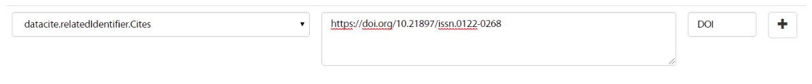
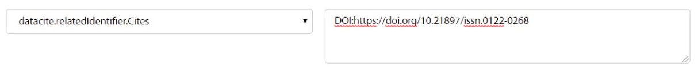

.. _dci:relatedIdentifier:

Related Identifier (Identificador relacionado) (R)
==================================================

``datacite:relatedIdentifier``

Definición y alcance del campo
------------------------------
Este campo contiene uno o varios identificadores de recursos relacionados con el recurso que se está describiendo. Este campo no contiene el Identificador primario del recurso, ni identificadores alternativos del mismo.

Este campo de identificador es utilizado conjuntamente con una propiedad de relación adjunta según corresponda. El uso de este campo es opcional pero recomendado.

Adicionalmente este campo permite gestionar las referencias bibliográficas (bibliografía) del recurso de información. (https://www.dublincore.org/specifications/dublin-core/dc-citation-guidelines/)

Niveles de persistencia (M/MA/R/O)
------------------------------------
Recomendado (R)

Niveles de ocurrencia (R / NR )
-------------------------------
Repetible (R) **0-n veces.**

..

Repita este campo para colocar cada uno de los identificadores relacionados necesarios.

Esquema de metadatos
--------------------
datacite:relatedIdentifier

- **Nota:** Este campo se ha adaptado del esquema de metadatos DATACITE MetadataKernel versión 4.1 (http://doi.org/10.5438/0014), el cual es utilizado ampliamente para la gestión de documentos y datos.

Traducción al español
---------------------
Identificador relacionado 

Forma de Descripción Normalizada (RDA / RCAA2 / ISBD)
-----------------------------------------------------
RDA (Recursos: descripción y acceso)

..

Revise la forma adecuada para ingresar el identificador relacionado con su debida puntuación según el esquema de identificación utilizado.

Para la gestión de recursos relacionados se puede utilizar texto libre ó identificadores normalizados según los vocabularios predefinidos.

Propiedades, atributos y especificadores de campo
-------------------------------------------------
 
Propiedad del Identificador Relacionado (relatedIdentifier) (R, 0-n): 
+++++++++++++++++++++++++++++++++++++++++++++++++++++++++++++++++++++
Esta propiedad permite especificar el valor del identificador relacionado que se le ha otorgado al recurso.

	- **Atributo: Tipo de identificador relacionado (relatedIdentifierType)  (M, 1 si la propiedad RelatedIdentifier es utilizada):** Este atributo permite especificar el tipo de identificador relacionado al recurso. Se debe tener en cuenta los siguientes tipos de identificadores y su codificación normalizada según el vocabulario controlado propuesto: 

+-------------------------+---------------------------------------------------------------------------------------------------------------------------------------------------------------------------------------------------------------------------------------------------------------------------------+------------------------+
| Vocabulario Normalizado | Descripción del Atributo                                                                                                                                                                                                                                                        | Dominio de Vocabulario |
+=========================+=================================================================================================================================================================================================================================================================================+========================+
| ARK                     | Clave de recursos de archivo                                                                                                                                                                                                                                                    | datacite               |
+-------------------------+---------------------------------------------------------------------------------------------------------------------------------------------------------------------------------------------------------------------------------------------------------------------------------+------------------------+
| arXiv                   | Identificador de https://arxiv.org/                                                                                                                                                                                                                                             | datacite               |
+-------------------------+---------------------------------------------------------------------------------------------------------------------------------------------------------------------------------------------------------------------------------------------------------------------------------+------------------------+
| bibcode                 | Códigos bibliográficos del Sistema de Datos Astrofísicos; bibcodes se pueden resolver a través de http://adsabs.harvard.edu/abs/bibcode                                                                                                                                         | datacite               |
+-------------------------+---------------------------------------------------------------------------------------------------------------------------------------------------------------------------------------------------------------------------------------------------------------------------------+------------------------+
| DOI                     | Identificador de Objeto Digital. Código alfanumérico que sirva para identificar de forma única un documento digital.                                                                                                                                                            | datacite               |
+-------------------------+---------------------------------------------------------------------------------------------------------------------------------------------------------------------------------------------------------------------------------------------------------------------------------+------------------------+
| EAN13                   | Número de artículo europeo, ahora renombrado como Número de artículo internacional, pero que conserva el acrónimo original, es un estándar de código de barras de 13 dígitos que es un superconjunto del sistema del Código de producto universal (UPC) original de 12 dígitos. | datacite               |
+-------------------------+---------------------------------------------------------------------------------------------------------------------------------------------------------------------------------------------------------------------------------------------------------------------------------+------------------------+
| EISSN                   | Número internacional normalizado de publicaciones seriadas (versión electrónica), permite identificar de manera única una colección seriada evitando posibles errores en la transcripción del título o información bibliográfica.                                               | datacite               |
+-------------------------+---------------------------------------------------------------------------------------------------------------------------------------------------------------------------------------------------------------------------------------------------------------------------------+------------------------+
| Handle                  | Es un identificador persistente, es decir, un sistema de especificación para nombres e identificación de servicios.                                                                                                                                                             | datacite               |
+-------------------------+---------------------------------------------------------------------------------------------------------------------------------------------------------------------------------------------------------------------------------------------------------------------------------+------------------------+
| IGSN                    | Número de muestra internacional Geo; un código alfanumérico de 9 dígitos que identifica de forma exclusiva muestras de nuestro entorno natural y funciones de muestreo relacionadas.                                                                                            | datacite               |
+-------------------------+---------------------------------------------------------------------------------------------------------------------------------------------------------------------------------------------------------------------------------------------------------------------------------+------------------------+
| ISBN                    | Número internacional normalizado de libros, es un identificador único para libros, prevista para su uso comercial.                                                                                                                                                              | datacite               |
+-------------------------+---------------------------------------------------------------------------------------------------------------------------------------------------------------------------------------------------------------------------------------------------------------------------------+------------------------+
| ISSN                    | Número internacional normalizado de publicaciones seriadas, permite identificar de manera única una colección seriada evitando posibles errores en la transcripción del título o información bibliográfica.                                                                     | datacite               |
+-------------------------+---------------------------------------------------------------------------------------------------------------------------------------------------------------------------------------------------------------------------------------------------------------------------------+------------------------+
| ISTC                    | Código internacional normalizado de obras textuales, es un identificador único para obras textuales siempre y cuando exista una intención de producir dicha obra en forma de una o más manifestaciones.                                                                         | datacite               |
+-------------------------+---------------------------------------------------------------------------------------------------------------------------------------------------------------------------------------------------------------------------------------------------------------------------------+------------------------+
| ISSN-L                  | Es un número específico que reúne los diferentes soportes en los que se edita una publicación seriada.                                                                                                                                                                          | datacite               |
+-------------------------+---------------------------------------------------------------------------------------------------------------------------------------------------------------------------------------------------------------------------------------------------------------------------------+------------------------+
| LSID                    | Es el identificador único de las ciencias naturales, considerándose una especificación en curso del Nombre del Recurso Uniforme (URN) y permite identificar los recursos en diferentes almacenes de datos biológicamente significativos.                                        | datacite               |
+-------------------------+---------------------------------------------------------------------------------------------------------------------------------------------------------------------------------------------------------------------------------------------------------------------------------+------------------------+
| PISSN                   | Número internacional normalizado de publicaciones seriadas, permite identificar de manera única una colección seriada evitando posibles errores en la transcripción del título o información bibliográfica. (versión impresa)                                                   | datacite               |
+-------------------------+---------------------------------------------------------------------------------------------------------------------------------------------------------------------------------------------------------------------------------------------------------------------------------+------------------------+
| PMID                    | ID de PubMed. Número único asignado a cada cita de artículo de revistas biomédicas y de las ciencias naturales.                                                                                                                                                                 | datacite               |
+-------------------------+---------------------------------------------------------------------------------------------------------------------------------------------------------------------------------------------------------------------------------------------------------------------------------+------------------------+
| PURL                    | Localizador de recursos uniforme y persistente, se utiliza para referenciar un determinado recurso que cambia de dirección a lo largo del tiempo desde una misma dirección.                                                                                                     | datacite               |
+-------------------------+---------------------------------------------------------------------------------------------------------------------------------------------------------------------------------------------------------------------------------------------------------------------------------+------------------------+
| UPC                     | Código de producto universal, es un código de barras utilizado para rastrear artículos comerciales. Su forma más común, la UPC-A, consta de 12 dígitos numéricos.                                                                                                               | datacite               |
+-------------------------+---------------------------------------------------------------------------------------------------------------------------------------------------------------------------------------------------------------------------------------------------------------------------------+------------------------+
| URL                     | Localizador Uniforme de Recursos, es la dirección específica que se le asigna a cada uno de los recursos disponibles en la red con el fin de localizarlos e identificarlos fácilmente.                                                                                          | datacite               |
+-------------------------+---------------------------------------------------------------------------------------------------------------------------------------------------------------------------------------------------------------------------------------------------------------------------------+------------------------+
| URN                     | Nombre del recurso uniforme, permite identificar recursos en la web pero no indica exactamente dónde se encuentra el recurso.                                                                                                                                                   | datacite               |
+-------------------------+---------------------------------------------------------------------------------------------------------------------------------------------------------------------------------------------------------------------------------------------------------------------------------+------------------------+
| WOS                     | Número de acceso a la Web of Science, es una identificación asociada a cada registro del producto, formado por el número de acceso del productor y un número secuencial.                                                                                                        | datacite               |
+-------------------------+---------------------------------------------------------------------------------------------------------------------------------------------------------------------------------------------------------------------------------------------------------------------------------+------------------------+
| OTHER                   | Texto libre para describir otro tipo de relaciones                                                                                                                                                                                                                              | redcol                 |
+-------------------------+---------------------------------------------------------------------------------------------------------------------------------------------------------------------------------------------------------------------------------------------------------------------------------+------------------------+

	- **Atributo: Tipo de Relación (relationType) (M, 1):** Este atributo permite describir la relación del recurso que se está describiendo (A) con otro recurso relacionado (B).  Es obligatorio si se utiliza la propiedad **relatedIdentifier.** Se debe tener en cuenta los siguientes tipos de relación y su codificación normalizada según el vocabulario controlado propuesto: 
	
+---------------------+---------------------------+---------------------------------------------------------------------------------------------------------------------------------------------------------------------------------------------------------------------------------------------------------------------------------------------------------------+------------------------+
| Vocabulario         | Traducción                | Descripción                                                                                                                                                                                                                                                                                                   | Dominio de Vocabulario |
+=====================+===========================+===============================================================================================================================================================================================================================================================================================================+========================+
| IsCitedBy           | Es citado por             | (indica que B incluye A en una cita)                                                                                                                                                                                                                                                                          | datacite               |
+---------------------+---------------------------+---------------------------------------------------------------------------------------------------------------------------------------------------------------------------------------------------------------------------------------------------------------------------------------------------------------+------------------------+
| Cites               | Cita                      | (indica que A incluye B en una cita)                                                                                                                                                                                                                                                                          | datacite               |
+---------------------+---------------------------+---------------------------------------------------------------------------------------------------------------------------------------------------------------------------------------------------------------------------------------------------------------------------------------------------------------+------------------------+
| IsSupplementTo      | Es complemento de         | (indica que A es un complemento de B)                                                                                                                                                                                                                                                                          | datacite              |
+---------------------+---------------------------+---------------------------------------------------------------------------------------------------------------------------------------------------------------------------------------------------------------------------------------------------------------------------------------------------------------+------------------------+
| IsSupplementedBy    | Es complementado por      | (indica que B es un complemento de A)                                                                                                                                                                                                                                                                           | datacite             |
+---------------------+---------------------------+---------------------------------------------------------------------------------------------------------------------------------------------------------------------------------------------------------------------------------------------------------------------------------------------------------------+------------------------+
| IsContinuedBy       | Es continuado por         | (indica que A es continuado por el trabajo B)                                                                                                                                                                                                                                                                 | datacite               |
+---------------------+---------------------------+---------------------------------------------------------------------------------------------------------------------------------------------------------------------------------------------------------------------------------------------------------------------------------------------------------------+------------------------+
| Continues           | Continúa                  | (indica que A es una continuación del trabajo B)                                                                                                                                                                                                                                                              | datacite               |
+---------------------+---------------------------+---------------------------------------------------------------------------------------------------------------------------------------------------------------------------------------------------------------------------------------------------------------------------------------------------------------+------------------------+
| IsDescribedBy       | Se describe por           | (indica que A está descrito por B)                                                                                                                                                                                                                                                                            | datacite               |
+---------------------+---------------------------+---------------------------------------------------------------------------------------------------------------------------------------------------------------------------------------------------------------------------------------------------------------------------------------------------------------+------------------------+
| Describes           | Describe                  | (indica que A describe a B)                                                                                                                                                                                                                                                                                   | datacite               |
+---------------------+---------------------------+---------------------------------------------------------------------------------------------------------------------------------------------------------------------------------------------------------------------------------------------------------------------------------------------------------------+------------------------+
| HasMetadata         | Tiene metadatos           | (indica que el recurso A tiene metadatos adicionales de B)                                                                                                                                                                                                                                                    | datacite               |
+---------------------+---------------------------+---------------------------------------------------------------------------------------------------------------------------------------------------------------------------------------------------------------------------------------------------------------------------------------------------------------+------------------------+
| IsMetadataFor       | Es metadatos para         | (indica metadatos adicionales A para un recurso B)                                                                                                                                                                                                                                                            | datacite               |
+---------------------+---------------------------+---------------------------------------------------------------------------------------------------------------------------------------------------------------------------------------------------------------------------------------------------------------------------------------------------------------+------------------------+
| HasVersion          | Tiene version             | (indica que A tiene una versión B)                                                                                                                                                                                                                                                                            | datacite               |
+---------------------+---------------------------+---------------------------------------------------------------------------------------------------------------------------------------------------------------------------------------------------------------------------------------------------------------------------------------------------------------+------------------------+
| IsVersionOf         | Es la versión de          | (indica que A es una versión de B)                                                                                                                                                                                                                                                                            | datacite               |
+---------------------+---------------------------+---------------------------------------------------------------------------------------------------------------------------------------------------------------------------------------------------------------------------------------------------------------------------------------------------------------+------------------------+
| IsNewVersionOf      | Es la nueva versión de    | (indica que A es una nueva edición de B, donde la nueva edición se ha modificado o actualizado)                                                                                                                                                                                                               | datacite               |
+---------------------+---------------------------+---------------------------------------------------------------------------------------------------------------------------------------------------------------------------------------------------------------------------------------------------------------------------------------------------------------+------------------------+
| IsPreviousVersionOf | Es la versión anterior de | (indica que A es una edición previa de B)                                                                                                                                                                                                                                                                     | datacite               |
+---------------------+---------------------------+---------------------------------------------------------------------------------------------------------------------------------------------------------------------------------------------------------------------------------------------------------------------------------------------------------------+------------------------+
| IsPartOf            | Es parte de               | (indica que A es una parte de B, puede usarse para describir documentos fuente)                                                                                                                                                                                                                               | datacite               |
+---------------------+---------------------------+---------------------------------------------------------------------------------------------------------------------------------------------------------------------------------------------------------------------------------------------------------------------------------------------------------------+------------------------+
| HasPart             | Tiene parte               | (indica que A incluye la parte B)                                                                                                                                                                                                                                                                             | datacite               |
+---------------------+---------------------------+---------------------------------------------------------------------------------------------------------------------------------------------------------------------------------------------------------------------------------------------------------------------------------------------------------------+------------------------+
| IsReferencedBy      | Es referenciado por       | (indica que A se usa como fuente de información por B)                                                                                                                                                                                                                                                        | datacite               |
+---------------------+---------------------------+---------------------------------------------------------------------------------------------------------------------------------------------------------------------------------------------------------------------------------------------------------------------------------------------------------------+------------------------+
| References          | Referencias               | (Indica que B se usa como fuente de información para A) NOTA: Este campo permite gestionar las referencias bibliográficas del recurso.                                                                                                                                                                        | datacite               |
+---------------------+---------------------------+---------------------------------------------------------------------------------------------------------------------------------------------------------------------------------------------------------------------------------------------------------------------------------------------------------------+------------------------+
| IsDocumentedBy      | Es documentado por        | (indica que B es documentación sobre / explicando A)                                                                                                                                                                                                                                                          | datacite               |
+---------------------+---------------------------+---------------------------------------------------------------------------------------------------------------------------------------------------------------------------------------------------------------------------------------------------------------------------------------------------------------+------------------------+
| Documents           | Documentos                | (indica que A es documentación sobre / explicando B)                                                                                                                                                                                                                                                          | datacite               |
+---------------------+---------------------------+---------------------------------------------------------------------------------------------------------------------------------------------------------------------------------------------------------------------------------------------------------------------------------------------------------------+------------------------+
| IsCompiledBy        | Es compilado por          | (indica que B se usa para compilar o crear A)                                                                                                                                                                                                                                                                 | datacite               |
+---------------------+---------------------------+---------------------------------------------------------------------------------------------------------------------------------------------------------------------------------------------------------------------------------------------------------------------------------------------------------------+------------------------+
| Compiles            | Compila                   | (indica que B es el resultado de un evento de compilación o creación usando A)                                                                                                                                                                                                                                | datacite               |
+---------------------+---------------------------+---------------------------------------------------------------------------------------------------------------------------------------------------------------------------------------------------------------------------------------------------------------------------------------------------------------+------------------------+
| IsVariantFormOf     | Es la forma variante de   | (indica que A es una variante o forma diferente de B, por ejemplo, forma calculada o calibrada o empaque diferente)                                                                                                                                                                                           | datacite               |
+---------------------+---------------------------+---------------------------------------------------------------------------------------------------------------------------------------------------------------------------------------------------------------------------------------------------------------------------------------------------------------+------------------------+
| IsOriginalFormOf    | Es la forma original de   | (indica que A es la forma original de B)                                                                                                                                                                                                                                                                      | datacite               |
+---------------------+---------------------------+---------------------------------------------------------------------------------------------------------------------------------------------------------------------------------------------------------------------------------------------------------------------------------------------------------------+------------------------+
| IsIdenticalTo       | Es idéntico a             | (indica que A es idéntico a B, para usar cuando es necesario registrar dos instancias separadas del mismo recurso)                                                                                                                                                                                            | datacite               |
+---------------------+---------------------------+---------------------------------------------------------------------------------------------------------------------------------------------------------------------------------------------------------------------------------------------------------------------------------------------------------------+------------------------+
| IsReviewedBy        | Es revisado por           | (indica que A es revisado por B)                                                                                                                                                                                                                                                                              | datacite               |
+---------------------+---------------------------+---------------------------------------------------------------------------------------------------------------------------------------------------------------------------------------------------------------------------------------------------------------------------------------------------------------+------------------------+
| Reviews             | Opiniones                 | (indica que A es una revisión de B)                                                                                                                                                                                                                                                                           | datacite               |
+---------------------+---------------------------+---------------------------------------------------------------------------------------------------------------------------------------------------------------------------------------------------------------------------------------------------------------------------------------------------------------+------------------------+
| IsDerivedFrom       | Se deriva de              | (indica que B es una fuente en la que se basa A)                                                                                                                                                                                                                                                              | datacite               |
+---------------------+---------------------------+---------------------------------------------------------------------------------------------------------------------------------------------------------------------------------------------------------------------------------------------------------------------------------------------------------------+------------------------+
| IsSourceOf          | Es fuente de              | (indica que A es una fuente en la que B se basa)                                                                                                                                                                                                                                                              | datacite               |
+---------------------+---------------------------+---------------------------------------------------------------------------------------------------------------------------------------------------------------------------------------------------------------------------------------------------------------------------------------------------------------+------------------------+
| IsRequiredBy        | Es requerido por          | (indica que A requiere B)                                                                                                                                                                                                                                                                                     | datacite               |
+---------------------+---------------------------+---------------------------------------------------------------------------------------------------------------------------------------------------------------------------------------------------------------------------------------------------------------------------------------------------------------+------------------------+
| Requires            | Requiere                  | (indica que A requiere B)                                                                                                                                                                                                                                                                                     | datacite               |
+---------------------+---------------------------+---------------------------------------------------------------------------------------------------------------------------------------------------------------------------------------------------------------------------------------------------------------------------------------------------------------+------------------------+
| IsPartOfSeries      | Es parte de la Serie      | (indica que A es una parte de una serie de publicación B; puede usarse para elementos de una serie)                                                                                                                                                                                                           | redcol                 |
+---------------------+---------------------------+---------------------------------------------------------------------------------------------------------------------------------------------------------------------------------------------------------------------------------------------------------------------------------------------------------------+------------------------+
| instname            | Nombre de la institución  | Indica que A pertenece a la institución B. Texto normalizado para los los recursos de información asociados a un dominio ó institución que serán usado exclusivamente para describir los identificadores relacionados: instname y reponame que son requeridos por LaReferencia.                               | redcol                 |
+---------------------+---------------------------+---------------------------------------------------------------------------------------------------------------------------------------------------------------------------------------------------------------------------------------------------------------------------------------------------------------+------------------------+
| reponame            | Nombre del Repositorio    | Indica que A pertenece al repositorio de la institución B. Texto normalizado para los los recursos de información asociados a un dominio ó institución que serán usado exclusivamente para describir los identificadores relacionados: instname y reponame que son requeridos por LaReferencia.               | redcol                 |
+---------------------+---------------------------+---------------------------------------------------------------------------------------------------------------------------------------------------------------------------------------------------------------------------------------------------------------------------------------------------------------+------------------------+
| repourl             | URL del repositorio       | Indica que A se encuentra en la URL del repositorio de la institución B. Texto normalizado para los los recursos de información asociados a un dominio ó institución que serán usado exclusivamente para describir los identificadores relacionados: instname y reponame que son requeridos por LaReferencia. | redcol                 |
+---------------------+---------------------------+---------------------------------------------------------------------------------------------------------------------------------------------------------------------------------------------------------------------------------------------------------------------------------------------------------------+------------------------+

	- **Atributo: Esquema de metadatos relacionado (relatedMetadataScheme)  (O, 0-1):** Este atributo permite establecer un esquema de metadatos utilizado para describir la relación del identificador. Este atributo debe ser únicamente utilizado si el atributo anterior relationType es utilizado y este contiene los valores (HasMetadata/IsMetadataFor).
	
	- **Atributo: URI del esquema de metadatos relacionado (schemeURI)  (O, 0-1):**  Este atributo permite establecer la URI normalizada del esquema de metadatos utilizado para describir la relación del identificador en un formato estándar (XSD,DDT, Turtle) . Este atributo debe ser únicamente utilizado si el atributo anterior relationType es utilizado y este contiene los valores (HasMetadata/IsMetadataFor).

	- **Atributo: Tipo de esquema de metadatos relacionado (schemeType)  (O, 0-1):** Este atributo contiene el tipo de formato del esquema de metadatos que fue vinculado en el atributo anterior schemeURI (XSD,DDT, Turtle). Este atributo debe ser únicamente utilizado si el atributo anterior relationType es utilizado y este contiene los valores (HasMetadata/IsMetadataFor).

	- **Atributo: Tipo de contenidos en el recurso relacionado (resourceTypeGeneral)  (O, 0-1):** Este campo describe el tipo de contenidos que se encuentran en el recurso relacionado. Se debe tener en cuenta los siguientes tipos de contenidos normalizados y su codificación normalizada según el vocabulario controlado propuesto: 

	+-------------------------+----------------------------------------------------------------------------------------------------------------------------------------------------------------------------------------------------------------------------------+------------------------+
	| Vocabulario Normalizado | Descripción del Atributo                                                                                                                                                                                                         | Dominio de Vocabulario |
	+=========================+==================================================================================================================================================================================================================================+========================+
	| Audiovisual             | Contenido Audiovisual/Multimedia. Una serie de representaciones visuales que imparten una impresión de movimiento cuando se muestran en sucesión. Puede o no incluir sonido. En el Vocabulario DC se representa como MovingImage | datacite               |
	+-------------------------+----------------------------------------------------------------------------------------------------------------------------------------------------------------------------------------------------------------------------------+------------------------+
	| Collection              | Contenido Colección. Una agregación de recursos, que puede abarcar colecciones de un tipo de recurso así como de tipos mixtos. Una colección se describe como un grupo; Sus partes también se pueden describir por separado.     | datacite               |
	+-------------------------+----------------------------------------------------------------------------------------------------------------------------------------------------------------------------------------------------------------------------------+------------------------+
	| DataPaper               | Contenido Publicación de datos. Una publicación especializada con la intención de identificar y describir datos específicos, conjuntos de datos o recopilaciones de datos para facilitar el descubrimiento.                      | datacite               |
	+-------------------------+----------------------------------------------------------------------------------------------------------------------------------------------------------------------------------------------------------------------------------+------------------------+
	| Dataset                 | Contenido Conjunto de datos. Datos codificados en una estructura definida.                                                                                                                                                       | datacite               |
	+-------------------------+----------------------------------------------------------------------------------------------------------------------------------------------------------------------------------------------------------------------------------+------------------------+
	| Event                   | Contenido Acontecimiento. Una ocurrencia no persistente, basada en el tiempo.                                                                                                                                                    | datacite               |
	+-------------------------+----------------------------------------------------------------------------------------------------------------------------------------------------------------------------------------------------------------------------------+------------------------+
	| Image                   | Contenido Imagen. Una representación visual que no sea texto. En el vocabulario DC se representa como Image, StillImage                                                                                                          | datacite               |
	+-------------------------+----------------------------------------------------------------------------------------------------------------------------------------------------------------------------------------------------------------------------------+------------------------+
	| InteractiveResource     | Contenido Recurso interactivo. Un recurso que requiere la interacción del usuario para ser comprendido, ejecutado o experimentado.                                                                                               | datacite               |
	+-------------------------+----------------------------------------------------------------------------------------------------------------------------------------------------------------------------------------------------------------------------------+------------------------+
	| Model                   | Contenido Modelo. Un modelo abstracto, conceptual, gráfico, matemático o de visualización que representa objetos empíricos, fenómenos o procesos físicos.                                                                        | datacite               |
	+-------------------------+----------------------------------------------------------------------------------------------------------------------------------------------------------------------------------------------------------------------------------+------------------------+
	| PhysicalObject          | Contenido Objeto físico. Un objeto o sustancia inanimada, tridimensional.                                                                                                                                                        | datacite               |
	+-------------------------+----------------------------------------------------------------------------------------------------------------------------------------------------------------------------------------------------------------------------------+------------------------+
	| Service                 | Contenido Servicio. Un sistema organizado de aparatos, aparatos, personal, etc., para suministrar algunas funciones requeridas por los usuarios finales.                                                                         | datacite               |
	+-------------------------+----------------------------------------------------------------------------------------------------------------------------------------------------------------------------------------------------------------------------------+------------------------+
	| Software                | Contenido Software. Un programa informático en código fuente (texto) o en forma compilada. Utilice este tipo de contenido para todos los componentes de software relacionados.                                                   | datacite               |
	+-------------------------+----------------------------------------------------------------------------------------------------------------------------------------------------------------------------------------------------------------------------------+------------------------+
	| Sound                   | Contenido Sonido. Un recurso destinado principalmente a ser escuchado.                                                                                                                                                           | datacite               |
	+-------------------------+----------------------------------------------------------------------------------------------------------------------------------------------------------------------------------------------------------------------------------+------------------------+
	| Text                    | Contenido Texto. Un recurso formado principalmente por palabras para la lectura.                                                                                                                                                 | datacite               |
	+-------------------------+----------------------------------------------------------------------------------------------------------------------------------------------------------------------------------------------------------------------------------+------------------------+
	| Workflow                | Contenido Flujo de Trabajo. Una serie estructurada de pasos que se pueden ejecutar para producir un resultado final, que permite a los usuarios especificar y ejecutar su trabajo de una manera más reproducible.                | datacite               |
	+-------------------------+----------------------------------------------------------------------------------------------------------------------------------------------------------------------------------------------------------------------------------+------------------------+
	| Other                   | Contenido Otros. Contenido que no se puede describir en los anteriores elementos.                                                                                                                                                | datacite               |
	+-------------------------+----------------------------------------------------------------------------------------------------------------------------------------------------------------------------------------------------------------------------------+------------------------+

Relaciones con otros campos
---------------------------

	- Este campo tiene una estrecha relación con el campo **dc.relation,** ya que especifica una relación del recurso con otro recurso a través del uso de identificadores normalizados.
	- En los campos **dc.relation** y sus respectivos calificadores, se puede complementar la información de la relación descrita en este campo utilizando texto libre.
	- No debe confundirse el Identificador relacionado **(datacite.relatedIdentifier)** del recurso el identificador alternativo **(datacite.alternativeIdentifier)** del mismo.
	- Para la gestión de referencias bibliográficas **(dc.relation.references / dcterms.references)** se debe utilizar el atributo: Tipo de Relación **(relationType)** con el valor de vocabulario controlado **“References”.** Se desaconseja la utilización del campo **"dc.source.bibliographicCitation"** ya que no se encuentra normalizado. (https://www.dublincore.org/specifications/dublin-core/dc-citation-guidelines/)
	- No debe confundirse el uso del campo de gestión de la Bibliografía de un recurso de información (Citas Bibliográficas) que se gestiona como elementos relacionados en el campo (datacite.relatedIdentifier(references) / dc.relation.references ) con el Identificador alternativo del Recurso mostrado como una cita Bibliográfica (dc.identifier.bibliographicCitation / dcterms.bibliographicCitation / dc.identifier.citation) y que contiene las cita bibliográfica que permite identificar el recurso de origen (Identifica de manera unívoca al recurso de origen en un formato normalizado (ISO, APA,IEEE, Vancouver, etc..)).
	

Restricciones
-------------
No aplica

Ejemplos y ayuda
----------------

Ayudas
++++++

**Identificador Relacionado:** Identificador del recurso, puede ser una cadena alfanumérica que sea única dentro de su dominio o emisión. También pueden utilizarse identificadores locales.

	- Ej: (metadataScheme): dc.relatedIdentifier.metadataScheme	DarwinCore	
	- Ej: (relation): dc.relatedIdentifier.relation	IsPartOf	
	- Ej: (schemeType): dc.relatedIdentifier.schemeType	URL	
	- Ej: (schemeURI): dc.relatedIdentifier.schemeURI	http://uninmar.icmyl.unam.mx/search?query=
	- Ej: (relatedIdentifier): dc.relatedIdentifier	Macrocallista nimbosa
	- Ej: (Nombre de la institución que provee el repositorio)(instname). Ej: Universidad de los Andes.
	- Ej: (Nombre del Repositorio) (reponame). Ej: Séneca.
	- Ej: (URL  del Repositorio) (repourl). Ej: https://repositorio.uniandes.edu.co 
	- Ej: Citación bibliográfica (dc.relation.references / dcterms.references): 
		- Altemeyer, B. (1981). Right-Wing Authoritarianism. Winnipeg: University of Manitoba Press.	
		- Asún, R. A., Rdz-Navarro, K., & Alvarado, J. M. (2015). Developing Multidimensional Likert Scales Using Item Factor Analysis: The Case of Four-point Items. Sociological Methods & Research, 45(8), 744-749. doi: https://doi.org/10.1177/0049124114566716.
		- Frank, R. H., & Bernanke, B. (2007). Principios de microeconomía. (3rd ed.). Boston, MA: McGraw-Hill/Irwin. 
		- Barros, T. S., Torres, A. R. R., & Pereira, C. (2009). Psico-USF (Vol. 14 ). Universidade São Francisco. Recuperado de http://pepsic.bvsalud.org/scielo.php?script=sci_arttext&pid=S1413-82712009000100006.

Ejemplo en XML (Interoperabilidad OAI-PMH)
++++++++++++++++++++++++++++++++++++++++++

**Esquema oai_dc**

.. code-block:: xml
   :linenos:

   	<dc:relation>(BIB LVL) t-PRODUCCIÓN UGR</dc:relation>
   	<dc:relation>(ES-GrU)b13b2009100x-34cbua_ugr</dc:relation>

.. code-block:: xml
   :linenos:

   <dc.relation.references>CEPAL. (2017). Panorama fiscal de américa latina. La movilización de recursos para el financiamiento del desarrollo sostenible </dc.relation.references>

**Esquema DataCite**

.. code-block:: xml
   :linenos:

   <datacite:relatedIdentifiers>
      <datacite:relatedIdentifier relatedIdentifierType="URL" relationType="HasPart">http://someUrl</datacite:relatedIdentifier>
   </datacite:relatedIdentifiers>

   <relatedIdentifiers>
      <relatedIdentifier relatedIdentifierType="DOI" relationType="Cites">10.1002/2015JD024666</relatedIdentifier>
      <relatedIdentifier relatedIdentifierType="DOI" relationType="Cites">10.5194/acp-17-4871-2017</relatedIdentifier>
   </relatedIdentifiers>

.. code-block:: xml
   :linenos:

   	<relatedIdentifier relatedIdentifierType="DOI" relationType="IsSourceOf"> https://doi.org/10.5194/angeo-36-1-2018 </relatedIdentifier> 

	<relatedIdentifier relatedIdentifierType="URL" relationType="IsSourceOf"> http://132.248.9.195/ptd2018/agosto/0778042/Index.html </relatedIdentifier>

**Esquema xoai**

.. code-block:: xml
   :linenos:

   	<element name="relation">
        <element name="cites">
            <element name="none">
               <field name="value">10.1002/2015JD024666</field>
               <field name="value">10.5194/acp-17-4871-2017</field>
            </element>
        </element>
    </element>

.. code-block:: xml
   :linenos:

   	<element name="dcterms">
      <element name="references">
         <element name="spa">
                 <field name="value">ABColombia, Corporación SISMA Mujer y The U.S. Office en Colombia (USOC) (2013). Colombia: Women, conflict – related sexual violence and the peace process. Recuperado de https://www.christianaid.org.uk/images/ABColombia-conflict-relatedsexual-violence-report.pdf</field>
       </element> 
     </element> 
	</element>

**Esquema dim**

.. code-block:: xml
   :linenos:

   	<dim:field mdschema="dc" element="relation" qualifier="isreferencedby">(BIB LVL) t-PRODUCCIÓN UGR</dim:field>
   	<dim:field mdschema="dc" element="relation" qualifier="isreferencedby">(ES-GrU)b13b2009100x-34cbua_ugr</dim:field>

.. code-block:: xml
   :linenos:

   	<dim:field mdschema="dcterms" element="references" lang="spa">Arias, A. (2008). Multiculturalismo y Derechos Indígenas. El caso mexicano. México D.F: Comisión Nacional de los Derechos Humanos.</dim:field>

Niveles de aplicación para productos de investigación de MinCiencias
--------------------------------------------------------------------
Aplica para libros, revistas, artículos, documentos de trabajo, proyectos de investigación, norma técnica, proyecto de ley.

Relaciones con otros modelos de metadatos
-----------------------------------------
El campo Identificador Relacionado (datacite:relatedIdentifier) es utilizado por los siguientes esquemas de metadatos y puede intercambiarse su uso de manera indistinta mientras se conserven sus distintos niveles de atributos y especificadores de campo:

+----------------------+-------------------------------------------------------------------+
| Esquema de Metadatos | Campo Relacionado                                                 |
+======================+===================================================================+
| dc                   | dc.relation                                                       |
+----------------------+-------------------------------------------------------------------+
| dcterms              | * dcterms.conformsTo                                              |
|                      | * dcterms.hasFormat                                               |
|                      | * dcterms.hasPart                                                 |
|                      | * dcterms.hasVersion                                              |
|                      | * dcterms.isFormatOf                                              |
|                      | * dcterms.isPartOf                                                |
|                      | * dcterms.IsPartOfSeries                                          |
|                      | * dcterms.isReferencedBy                                          |
|                      | * dcterms.isReplacedBy                                            |
|                      | * dcterms.isRequiredBy                                            |
|                      | * dcterms.isVersionOf                                             |
|                      | * dcterms.references                                              |
|                      | * dcterms.replaces                                                |
|                      | * dcterms.requires                                                |
+----------------------+-------------------------------------------------------------------+
| marcxml              | field: 050, 052, 055, 061, 071, 072, 080, 082, 084, 086, 088, 090 |
+----------------------+-------------------------------------------------------------------+

+----------------------+-------------------------------------------------------------------+
| Esquema de Metadatos | Campo Relacionado                                                 |
+======================+===================================================================+
| dc                   | dc.relation                                                       |
+----------------------+-------------------------------------------------------------------+
| dcterms              | * dcterms.conformsTo                                              |
|					   | * dcterms.hasFormat											   |
|					   | * dcterms.hasPart												   |
|					   | * dcterms.hasVersion											   |
|					   | * dcterms.isFormatOf											   |
|					   | * dcterms.isPartOf												   |
|                      | * dcterms.IsPartOfSeries                                          |
|					   | * dcterms.isReferencedBy										   |
|					   | * dcterms.isReplacedBy											   |
|					   | * dcterms.isRequiredBy											   |
|					   | * dcterms.isVersionOf											   |
|					   | * dcterms.references											   |
|					   | * dcterms.replaces												   |
|					   | * dcterms.requires												   |
+----------------------+-------------------------------------------------------------------+
| marcxml              | field: 050, 052, 055, 061, 071, 072, 080, 082, 084, 086, 088, 090 |
+----------------------+-------------------------------------------------------------------+

Niveles semánticos
------------------

- Este campo contempla la utilización de distintos calificadores de relación como atributos estandarizados según un vocabulario específico **(relationType).**
- Adicionalmente, se toma un elemento de identificación estandarizados según un vocabulario específico como un atributo asociado a un identificador persistente **(relatedIdentifierType).**
- Así mismo se utiliza un vocabulario controlado para especificar el tipo de contenido que tiene el recurso relacionado **(resourceTypeGeneral).**

Recomendación de campos de aplicación en DSPACE
-----------------------------------------------

Para la gestión de la **bibliografía** se recomienda utilizar el campo **(dc.relation.references)**, allí se puede registrar las referencias bibliográficas del recurso en estilos de citación normalizados. Se recomienda tomarlas tal cual como aparecen en el recurso. Ej: Loyola A, Tagami H, Bonaldi T, Roche D, Quivy JP, Imhof A, et al. The HP1alpha-CAF1-SetDB1-containing complex provides H3K9me1 for Suv39-mediated K9me3 in pericentric heterochromatin. EMBO Rep [Internet]. 2009 Jul;10(7):769–75.

Para tener una guía de los estilos de citación, se recomienda revisar las siguientes normas:

- **APA (American Psychological Association):**  Este estilo ya cuenta con seis ediciones y explica cómo se deben presentar artículos científicos: márgenes, fuente, tamaño de letra, uso de color, gráficas, tablas, y citación y referenciación. 
- **ICONTEC:** Estas normas fueron definidas por el comité técnico del Instituto Colombiano de Normas Técnicas y Certificación, el cual es un organismo multinacional de carácter privado, dedicado a la gestión de la calidad en Colombia, Chile, Ecuador, El Salvador, Guatemala, Honduras y Perú.
- **IEEE (Institute of Electrical and Electronics Engineers):** Este estilo de citación es definido por la asociación científica internacional de técnicos e ingenieros dedicados a la estandarización y desarrollo, es el más utilizado en áreas de ingeniería para todo tipo de documentos. 
- **MLA (Modern Language Association):** Es un estilo y formato de citación bibliográfica para revistas, libros y otro tipo de textos académicos. Es utilizado principalmente en áreas de humanidades y artes,​ sobre todo en filosofía, crítica literaria, literatura comparada y en campos interdisciplinarios, como los estudios culturales.
- **VANCOUVER:** Este estilo de citación válidas para todo tipo de documentos específico para las áreas de Ciencias de la Salud.

Se recomienda crear/modificar el componente de registro de metadatos (y sus correspondientes hojas de entrada de datos) de los sistemas DSPACE basados en los siguientes elementos:

	- Para especificar recursos relacionados a través de identificadores normalizados ó utilizando texto libre, utilice el campo **dc.relation** y los siguientes calificadores de campo:
	
	+----------------------------------------+----------------------------+---------------------+-----------------+
	| Vocabulario controlado OpenAire/RedCol | Campo Elemento DSPACE      | Calificadores       | Nota de alcance |
	+========================================+============================+=====================+=================+
	| IsCitedBy                              | dc.relation                | iscitedby           |                 |
	+----------------------------------------+----------------------------+---------------------+-----------------+
	| Cites                                  | dc.relation                | cites               |                 |
	+----------------------------------------+----------------------------+---------------------+-----------------+
	| IsSupplementTo                         | dc.relation                | issupplementto      |                 |
	+----------------------------------------+----------------------------+---------------------+-----------------+
	| IsSupplementedBy                       | dc.relation                | issupplementedby    |                 |
	+----------------------------------------+----------------------------+---------------------+-----------------+
	| IsContinuedBy                          | dc.relation                | iscontinuedby       |                 |
	+----------------------------------------+----------------------------+---------------------+-----------------+
	| Continues                              | dc.relation                | continues           |                 |
	+----------------------------------------+----------------------------+---------------------+-----------------+
	| IsDescribedBy                          | dc.relation                | isdescribedby       |                 |
	+----------------------------------------+----------------------------+---------------------+-----------------+
	| Describes                              | dc.relation                | describes           |                 |
	+----------------------------------------+----------------------------+---------------------+-----------------+
	| HasMetadata                            | dc.relation                | hasmetadata         |                 |
	+----------------------------------------+----------------------------+---------------------+-----------------+
	| IsMetadataFor                          | dc.relation                | ismetadatafor       |                 |
	+----------------------------------------+----------------------------+---------------------+-----------------+
	| HasVersion                             | dc.relation                | hasversion          |                 |
	+----------------------------------------+----------------------------+---------------------+-----------------+
	| IsVersionOf                            | dc.relation                | isversionof         |                 |
	+----------------------------------------+----------------------------+---------------------+-----------------+
	| IsNewVersionOf                         | dc.relation                | isnewversionof      |                 |
	+----------------------------------------+----------------------------+---------------------+-----------------+
	| IsPreviousVersionOf                    | dc.relation                | ispreviousversionof |                 |
	+----------------------------------------+----------------------------+---------------------+-----------------+
	| IsPartOf                               | dc.relation                | ispartof            |                 |
	+----------------------------------------+----------------------------+---------------------+-----------------+
	| IsPartOfSeries                         | dc.relation                | ispartofseries      |                 |
	+----------------------------------------+----------------------------+---------------------+-----------------+
	| HasPart                                | dc.relation                | haspart             |                 |
	+----------------------------------------+----------------------------+---------------------+-----------------+
	| IsReferencedBy                         | dc.relation                | isreferencedby      |                 |
	+----------------------------------------+----------------------------+---------------------+-----------------+
	| References                             | dc.relation                | references          |                 |
	+----------------------------------------+----------------------------+---------------------+-----------------+
	| IsDocumentedBy                         | dc.relation                | isdocumentedby      |                 |
	+----------------------------------------+----------------------------+---------------------+-----------------+
	| Documents                              | dc.relation                | documents           |                 |
	+----------------------------------------+----------------------------+---------------------+-----------------+
	| IsCompiledBy                           | dc.relation                | iscompiledby        |                 |
	+----------------------------------------+----------------------------+---------------------+-----------------+
	| Compiles                               | dc.relation                | compiles            |                 |
	+----------------------------------------+----------------------------+---------------------+-----------------+
	| IsVariantFormOf                        | dc.relation                | isvariantformof     |                 |
	+----------------------------------------+----------------------------+---------------------+-----------------+
	| IsOriginalFormOf                       | dc.relation                | isoriginalformof    |                 |
	+----------------------------------------+----------------------------+---------------------+-----------------+
	| IsIdenticalTo                          | dc.relation                | isidenticalto       |                 |
	+----------------------------------------+----------------------------+---------------------+-----------------+
	| IsReviewedBy                           | dc.relation                | isreviewedby        |                 |
	+----------------------------------------+----------------------------+---------------------+-----------------+
	| Reviews                                | dc.relation                | reviews             |                 |
	+----------------------------------------+----------------------------+---------------------+-----------------+
	| IsDerivedFrom                          | dc.relation                | isderivedfrom       |                 |
	+----------------------------------------+----------------------------+---------------------+-----------------+
	| IsSourceOf                             | dc.relation                | issourceof          |                 |
	+----------------------------------------+----------------------------+---------------------+-----------------+
	| IsRequiredBy                           | dc.relation                | isrequiredby        |                 |
	+----------------------------------------+----------------------------+---------------------+-----------------+
	| Requires                               | dc.relation                | requires            |                 |
	+----------------------------------------+----------------------------+---------------------+-----------------+

	**Nota:** 
		- Para especificar el tipo de identificador utilizado **(relatedIdentifierType)** en el campo de datacite.relatedIdentifier **(dc.relation)** el cual tiene asociado un vocabulario controlado (DOI, HANDLE, URI, etc..) se puede realizar por dos vías:

			- Reutilizando el atributo **idioma** para almacenar el valor autorizado del tipo de identificador que se muestra en DSPACE en el momento que se edita un ítem.
			

..

   			- Utilizando como **prefijo** asociado al contenido del campo el valor autorizado del tipo de identificador (Vocabulario controlado) seguido del signo “:”. Ejemplo para describir un recurso relacionado mediante un DOI, se escribe: 

..

..
   			
   		- **Para gestionar las referencias bibliográficas (bibliografía),** utilice  los campos dc.relation.references y/o dcterms.references
   		
+----------------------------------------+-----------------------+---------------+------------------------------------------------------------------------------------------------------------------+
| Vocabulario controlado OpenAire/RedCol | Campo Elemento DSPACE | Calificadores | Nota de alcance                                                                                                  |
+========================================+=======================+===============+==================================================================================================================+
| RedCol                                 | dc.relation dcterms   | references    | Cita bibliográfica. Se aplica equivalencia semántica para los campos dc.relation.references y dcterms.references |
+----------------------------------------+-----------------------+---------------+------------------------------------------------------------------------------------------------------------------+

   		- **Para especificar la relación del recurso de información respecto al repositorio y la institución (utilizado por LaReferencia),** utilice el campo dc.identifier con los siguientes calificadores

+----------------------------------------+-----------------------+---------------+-------------------------------------------------------+
| Vocabulario controlado OpenAire/RedCol | Campo Elemento DSPACE | Calificadores | Nota de alcance                                       |
+========================================+=======================+===============+=======================================================+
| instname                               | dc.identifier         | instname      | Utilice el prefijo: instname:                         |
|                                        |                       |               | - instname:Universidad Nacional de Colombia           |
+----------------------------------------+-----------------------+---------------+-------------------------------------------------------+
| reponame                               | dc.identifier         | reponame      | Utilice el prefijo: reponame:                         |
|                                        |                       |               | - reponame:BDigital                                   |
+----------------------------------------+-----------------------+---------------+-------------------------------------------------------+
| repourl                                | dc.identifier         | repourl       | Utilice el prefijo: repourl:                          |
|                                        |                       |               | - repourl: http://www.bdigital.unal.edu.co/           |
+----------------------------------------+-----------------------+---------------+-------------------------------------------------------+

Recomendaciones de migración de otras directrices de metadatos (BDCOL, SNAAC, LA REFERENCIA, OPENAIRE 2, OPENAIRE 3)
--------------------------------------------------------------------------------------------------------------------

- Se recomienda específicamente crear los nuevos atributos/especificadores del campo de identificador alternativo según la codificación propuesta.
