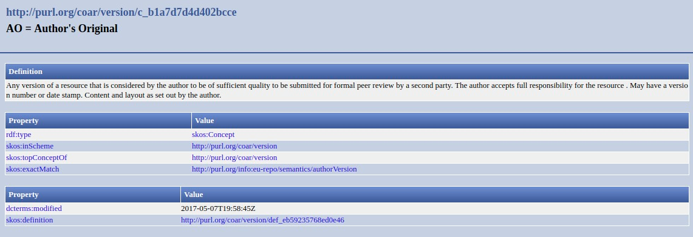

.. _aire:version:

Versión del recurso (R)
=======================

``oaire:version``

Definición y alcance del campo
------------------------------
Dependiendo del tipo de recurso, este campo se utiliza para colocar la versión de un conjunto de datos o software, o del estado del proceso de un artículo de revista. 

Niveles de requerimientos (M/MA/R/O)
------------------------------------
Recomendado (R)

Niveles de ocurrencia (R / NR -  Cantidad Veces)
------------------------------------------------
No repetible (NR)

Campo con esquema de metadatos
------------------------------
oaire:version

Traducción al español
---------------------
Versión del recurso 

Forma de Descripción Normalizada (RDA / RCAA2)
----------------------------------------------
RDA (Recursos: descripción y acceso)

Revise la forma adecuada para ingresar la versión del recurso:

**oaire:version:** Se puede colocar la información con letras o números. 

- Ej: 1.0.1 
- Ej: Segunda versión

Valores permitidos (Vocabularios Controlados)
---------------------------------------------
oaire:version 

Relaciones con otros campos
---------------------------

Restricciones
-------------

Ejemplos
--------

.. code-block:: xml
   :linenos:

   <oaire:version>1.0.3</oaire:version>

.. code-block:: xml
   :linenos:

   <oaire:version uri="http://purl.org/coar/version/c_be7fb7dd8ff6fe43">AM</oaire:version>

.. _COAR Version Types Vocabulary: http://vocabularies.coar-repositories.org/documentation/version_types/
.. _JAV: https://www.niso.org/publications/niso-rp-8-2008-jav

Atributos de Campo
------------------
Revise en el siguiente enlace los vocabularios controlados: http://vocabularies.coar-repositories.org/documentation/version_types/

Versión controlada

+---------------------------------------------------+----------+---------------------------------+
| ConceptURI                                        | Etiqueta | Comentario                      |
+===================================================+==========+=================================+
| http://purl.org/coar/version/c_b1a7d7d4d402bcce   | AO       | Original del autor              |
+---------------------------------------------------+----------+---------------------------------+
| http://purl.org/coar/version/c_71e4c1898caa6e32   | SMUR     | Manuscrito enviado bajo revisión|
+---------------------------------------------------+----------+---------------------------------+
| http://purl.org/coar/version/c_ab4af688f83e57aa   | AM       | Manuscrito aceptado             |
+---------------------------------------------------+----------+---------------------------------+
| http://purl.org/coar/version/c_fa2ee174bc00049f   | P        | Prueba                          |
+---------------------------------------------------+----------+---------------------------------+
| http://purl.org/coar/version/c_970fb48d4focketsa85| VoR      | Versión de registro             |
+---------------------------------------------------+----------+---------------------------------+
| http://purl.org/coar/version/c_e19f295774971610   | CVoR     | Versión corregida del registro  |
+---------------------------------------------------+----------+---------------------------------+
| http://purl.org/coar/version/c_dc82b40f9837b551   | EVoR     | Versión mejorada de registro    |
+---------------------------------------------------+----------+---------------------------------+
| http://purl.org/coar/version/c_be7fb7dd8ff6fe43   | NA       | No aplicable (o desconocido)    |
+---------------------------------------------------+----------+---------------------------------+

Especificadores de campo
------------------------

Niveles de aplicación para productos de investigación de Colciencias
--------------------------------------------------------------------
Se aplica a todos los productos de Colciencias. 

Relaciones con otros modelos de metadatos
-----------------------------------------

Niveles semánticos
------------------

Tomado de: `Vocabularios controlados Coar <http://vocabularies.coar-repositories.org/version/c_b1a7d7d4d402bcce.html>`_

Recomendación de campos de aplicación en DSPACE
-----------------------------------------------

Se recomienda crear los siguientes campos en Dspace:

- oaire:version

Recomendaciones de migración de Modelos anteriores (BDCOL, SNAAC, LA REFERENCIA, OPENAIRE 2, OPENAIRE 3)
--------------------------------------------------------------------------------------------------------
