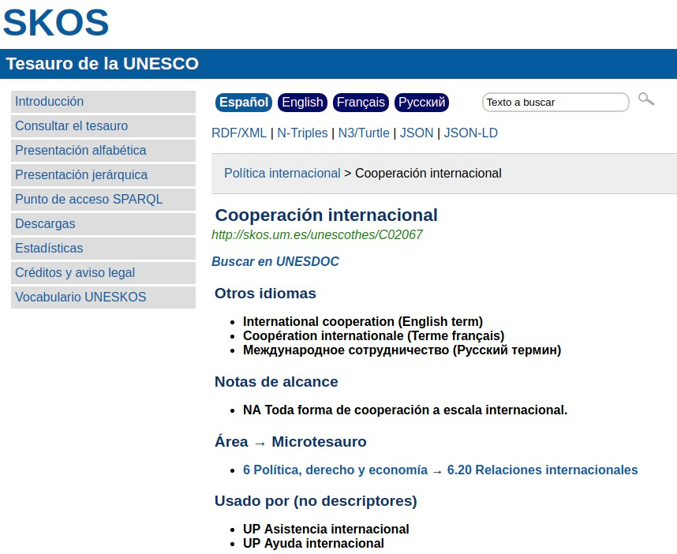
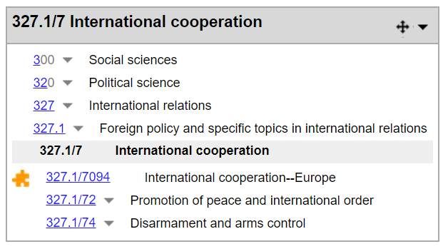

.. _dci:subject:

Materia (MA)
============

``datacite:subject``

Definición y alcance del campo
------------------------------
Asunto, palabra clave, tema o frase que describe al recurso. Es un punto de acceso que tiene el recurso para ser consultado por el usuario.

Puede elegir palabras más significativas evitando que sea demasiado general sino más específica. 

Se recomienda el uso de términos controlados localizados en tesauros o listas de encabezamientos de materias. En caso de que no estén controladas utilice el punto y coma seguido del término y si este se repite debe utilizarse de la misma forma. 

No confundir con Condición de la licencia (R).

Niveles de requerimientos (M/MA/R/O)
------------------------------------
Obligatorio si es aplicable (MA)

Niveles de ocurrencia (R / NR -  Cantidad Veces)
------------------------------------------------
Repetible (R)

Campo con esquema de metadatos
------------------------------
datacite:subject

Traducción al español
---------------------

- Materia
- Punto de acceso

Forma de Descripción Normalizada (RDA / RCAA2)
----------------------------------------------
RDA (Recursos: descripción y acceso)

Revise la forma adecuada para ingresar las materias o puntos de acceso del recurso:

- **datacite:subject-ocde:** Términos controlados del tesauro de la OCDE. Ej: Cooperación internacional

- **datacite:subject-skos:** Términos controlados del tesauro Skos. Ej: Cooperación internacional - uri: http://skos.um.es/unescothes/C02067
  

Tomado de: Skos Tesauro de la UNESCO [#]_

.. [#] http://skos.um.es/unescothes/C02067/html

- **datacite:subject-dewey:** Registre el número de clasificación según la temática del recurso. Ej: 327.17
  

Tomado de: Web Dewey [#]_

.. [#] http://dewey.org/webdewey/index_11.html?recordId=ddc:327.17

Valores permitidos (Vocabularios Controlados)
---------------------------------------------
datacite:subject

Relaciones con otros campos
---------------------------

Restricciones
-------------

Ejemplos
--------

.. code-block:: xml
   :linenos:

   <datacite:subjects>
    <datacite:subject>Geología</datacite:subject>
    <datacite:subject subjectScheme="DDC" schemeURI="http://dewey.info/" valueURI="">
    551 Geología, hidrología
    </datacite:subject>
   </datacite:subjects>

.. _DataCite MetadataKernel: http://schema.datacite.org/meta/kernel-4.1/

Atributos de Campo
------------------
- Puede utilizar los siguientes recursos de apoyo:
- OCLC: https://www.oclc.org/en/dewey/resources.html 
- Web Dewey: http://dewey.org/webdewey/login/login.html;jsessionid=C0A03467C7163D3F5BA72035654B8AA3 
- Armarc en línea: http://www.armarcenlinea.com/web/pages/publico/index.php 
- Lemb digital: http://www.lembdigital.com/new/es/home_es/ 
- Tesauro Unesco: http://vocabularies.unesco.org/browser/thesaurus/es/ 
- Skos tesauro: https://skos.um.es/unescothes/?l=es 

Especificadores de campo
------------------------

- datacite:subject-ocde
- datacite:subject-skos
- datacite:subject-armarc
- datacite:subject-lemb
- datacite:subject-dewey
- datacite:subject-oclc

Niveles de aplicación para productos de investigación de Colciencias
--------------------------------------------------------------------
Se aplica a todos los productos de Colciencias. 

Observaciones del campo
-----------------------

Relaciones con otros modelos de metadatos
-----------------------------------------

Niveles semánticos
------------------

Recomendación de Campos de aplicación en DSPACE
-----------------------------------------------

Se recomienda crear los siguientes campos en Dspace:

- datacite:subject-ocde
- datacite:subject-skos
- datacite:subject-armarc
- datacite:subject-lemb
- datacite:subject-dewey
- datacite:subject-oclc

Y otros que la institución considere pertinentes.

Recomendaciones de migración de Modelos anteriores (BDCOL, SNAAC, LA REFERENCIA, OPENAIRE 2, OPENAIRE 3)
--------------------------------------------------------------------------------------------------------