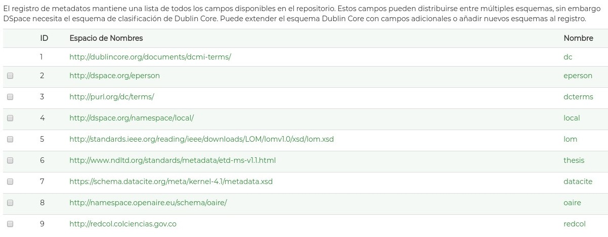

.. _formatoMeta:

Formato de metadatos
====================

Aunque el modelo de metadatos utilizado de manera predominante hasta el momento ha sido Dublin Core (modelo de metadatos ha sido desarrollado por la DCMI - Dublin Core Metadata Initiative) en su versión básica (15 Campos), se hace evidente que se requiere aumentar y normalizar la cantidad de campos de metadatos y modelos (esquemas) de metadatos asociados con el fin de proveer mayor calidad semántica de los datos.

Así mismo, se requiere diferenciar el entorno de utilización de los metadatos en los distintos sistemas de información documentales (Sistemas de información de investigación, Repositorios institucionales , Bibliotecas Digitales, y Sistemas de publicación monográficos/seriados es el componente de Interoperabilidad del sistema de información) ya que en general, no se tiene claridad de la diferencia de uso y aplicación de los metadatos de entrada y los metadatos de salida y la transformación (mapeo - crosswalk) de los campos en estas dos instancias dependiendo del entorno de utilización:

 * Metadatos de Entrada: Corresponde con el conjunto de campos agregados al recurso de información en el momento de su creación ó registro en un sistema informático asociado (Sistema de Información). Estos campos son generalmente agregados por humanos y máquinas (campos automáticos). Generalmente se utiliza el conjunto de campos asociado al modelo dublon core con calificadores (especificadores) de campo (ej. DC.relation.hasPart)
 
 * Metadatos de Salida: Corresponde con el conjunto de campos desplegados mediante  una interfaz de salida del sistema de información y que son transformados  (Distintos modelos de metatados) de acuerdo a los requerimientos del usuario (Humano / Maquina)

El conjunto de directrices de RedCol ha tomado en cuenta los siguientes modelos de metadatos existentes con el fin de promover arquitecturas más abiertas que involucren nuevos alcances de campos, nuevas y distintas tipologías documentales y nuevos vocabularios especializados para la descripción estandarizada de los recursos de información:

.. tabularcolumns:: |\Y{0.4}|\Y{0.2}|\Y{0.4}|
+-------------------------------------------------------------+------------------------------------------+--------------------------------------------------------------------------+
| Modelo de Metadatos                                         | Codificación REDCOL (espacios de Nombre) | URL Esquema Definición                                                   |
+=============================================================+==========================================+==========================================================================+
| Simple DC XML Schema                                        | dc                                       | http://purl.org/dc/elements/1.1/                                         |
+-------------------------------------------------------------+------------------------------------------+--------------------------------------------------------------------------+
| DCMI Metadata Terms Schema                                  | dcterms                                  | http://purl.org/dc/terms/                                                |
+-------------------------------------------------------------+------------------------------------------+--------------------------------------------------------------------------+
| Learning Object Metadata Schema definition (LOM)            | lom                                      | http://standards.ieee.org/reading/ieee/downloads/LOM/lomv1.0/xsd/lom.xsd |
+-------------------------------------------------------------+------------------------------------------+--------------------------------------------------------------------------+
| Electronic Theses and Dissertation Metadata Schema (ETD-MS) | thesis                                   | http://www.ndltd.org/standards/metadata/etd-ms-v1.1.html                 |
+-------------------------------------------------------------+------------------------------------------+--------------------------------------------------------------------------+
| DataCite Metadata Schema                                    | datacite                                 | https://schema.datacite.org/meta/kernel-4.1/metadata.xsd                 |
+-------------------------------------------------------------+------------------------------------------+--------------------------------------------------------------------------+
| OpenAire Specification Schema                               | oaire                                    | http://namespace.openaire.eu/schema/oaire/                               |
+-------------------------------------------------------------+------------------------------------------+--------------------------------------------------------------------------+

La Red Colombiana de Información Científica espera que los metadatos utilizados los distintos sistemas de información que se adhieran a la iniciativa y se codifiquen siguiendo el formato de metadatos definido en el **“Perfil de aplicación de metadatos”** que se presenta en este documento.

Para interoperabilidad en sistemas DSPACE, se recomienda crear un listado de modelos de metadatos que incluya los modelos de metadaots anteriormente mencionados con sus correspondientes campos:

